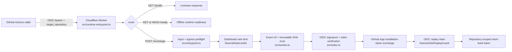
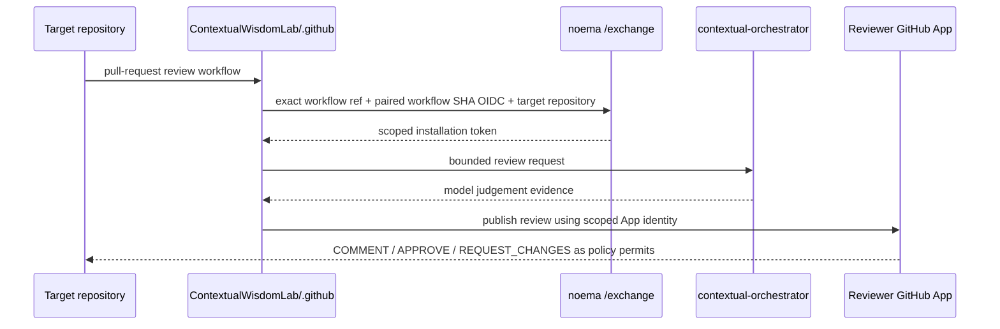

# Noema Architecture & Trust Boundaries

**Status: Proposed canonical architecture — In review on PR #71.** 이 파일은 #71이 protected `main`에 병합되기 전에는 protected-main authority가 아닙니다. 아래 설명은 현재 protected-main 동작과 #71에서 검토 중인 architecture/runtime hardening을 함께 재구성하되, unmerged behavior는 `Proposed`/`In review`로 취급합니다. 구현 세부사항을 읽지 않아도 운영자, 신규 개발자, 보안 검토자, 인수 실사 담당자가 Noema의 역할과 권한 경계를 이해할 수 있도록 작성합니다.

Noema의 핵심 원칙은 간단합니다. **신뢰할 수 있는 GitHub Actions OIDC 신원을 검증한 뒤, 요청된 저장소에 최소 권한 GitHub App installation token을 발급하되, 모델 판단·검토·병합·릴리스·배포 권한은 서로 분리합니다.** Noema 자체는 검토 결과를 판단하지 않으며, 중앙 리뷰 워크플로와 다른 CWL 서비스가 사용할 수 있는 자격 증명 교환 서비스입니다.

## 1. 시스템 경계

#71의 현재 proposed runtime topology는 Cloudflare Worker 하나와 SQLite-backed Durable Object 두 종류입니다. Worker의 배포 진입점은 `src/runtime-entrypoint.ts`이며 이 branch의 `wrangler.toml` `main`이 해당 파일을 가리킵니다. Protected-main acceptance 전에는 이 문단을 deployed proof로 사용하지 않습니다.

- `src/runtime-entrypoint.ts`: `/ready` runtime-readiness probe를 담당하고 나머지 요청을 아래 계층으로 전달합니다.
- `src/entrypoint.ts`: GitHub API origin, credential-bearing outbound fetch 정책, OIDC bearer envelope, `/exchange` JSON body 크기 같은 바깥쪽 입력·egress 경계를 검증합니다.
- `src/worker.ts`: 분산 rate limit, exact workflow ref와 immutable workflow SHA의 결합, OIDC replay protection을 적용합니다.
- `src/index.ts`: 서명된 GitHub Actions OIDC JWT를 검증하고 GitHub App JWT/installation token 교환을 수행하는 핵심 프로토콜 구현입니다.
- `NoemaRateLimiter`: SQLite-backed Durable Object로 `/exchange`의 권한 발급 전 분산 fixed-window rate limit을 조정합니다.
- `NoemaOidcReplayGuard`: SQLite-backed Durable Object로 검증된 OIDC `jti`의 단일 사용을 조정합니다.

`wrangler.toml`은 같은 두 Durable Object binding을 선언합니다.

```text
NOEMA_RATE_LIMITER       → NoemaRateLimiter
NOEMA_OIDC_REPLAY_GUARD  → NoemaOidcReplayGuard
```

`/health`, `/ready`, `/exchange`는 서로 다른 의미를 갖습니다. `/health`는 프로세스 liveness, `/ready`는 credential-exchange 구성 readiness, `/exchange`는 실제 권한 교환 API입니다. 운영자는 `/health` 성공만으로 `/exchange`가 안전하게 서비스 가능한 상태라고 판단하면 안 됩니다. #71의 proposed readiness trust는 trusted workflow ref뿐 아니라 `ALLOWED_WORKFLOW_SHA`가 canonical 40자리 Git SHA인지도 확인합니다.

## 2. 런타임 데이터 흐름

아래 순서는 #71 branch의 proposed exact-workflow-source trust를 포함합니다. Replay claim을 privileged GitHub token mint 이전으로 이동하는 #83은 아직 이 diagram의 protected behavior가 아니며 별도 Proposed work입니다.



실제 세부 순서는 구현의 fail-closed 조건에 따라 중간에서 종료될 수 있습니다. 예를 들어 trusted client identity, rate-limit binding, workflow trust configuration, OIDC validation, replay state 또는 GitHub API boundary 중 하나라도 검증되지 않으면 후속 권한 사용을 진행하지 않습니다.

## 3. 중앙 리뷰와의 결합

Noema는 독립 실행 가능하지만 ContextualWisdomLab의 중앙 리뷰 체계와 결합될 수 있도록 설계되어 있습니다.



중앙 `ContextualWisdomLab/.github`는 재사용 가능한 review workflow와 조직 차원의 정책을 제공할 수 있습니다. `contextual-orchestrator`는 LLM 요청의 모델 라우팅·추론 orchestration을 담당하며, Noema 런타임은 특정 모델 공급자에 직접 종속되지 않습니다. `naruon` 및 다른 CWL 서비스는 동일한 공개 계약과 조직 정책을 통해 Noema를 독립 서비스로 호출하거나 상위 MSA의 credential/review 모듈로 조합할 수 있어야 합니다.

이 결합은 **선택적**입니다. Noema는 `naruon`의 데이터베이스, 프로세스 또는 배포 생명주기에 의존해서는 안 되며, 중앙 workflow가 없어도 Worker의 `/health`, `/ready`, `/exchange` 프로토콜과 테스트 가능한 보안 경계는 독립적으로 유지됩니다.

## 4. 권한과 증거의 분리

Noema의 commercial/acquisition posture에서 가장 중요한 설계 규칙은 증거와 권한을 섞지 않는 것입니다.

| Plane | 의미 | 권한으로 사용 가능한가? |
| --- | --- | --- |
| runner assignment evidence | workflow job이 runner에 배정·시작될 수 있었는지에 대한 operational observation | check success, source correctness, approval 또는 merge authority가 아님 |
| check runs | GitHub Actions 실행 결과 | 단독으로 승인·병합 권한이 아님 |
| commit statuses | 외부 integration status | check runs 또는 review를 대체하지 않음 |
| review evidence | human/bot review의 근거와 thread | 정책이 요구하는 적격 approval과 구분 |
| model judgement | LLM이 생성한 판단 | 독립 GitHub review나 merge authority가 아님 |
| merge authority | protected-branch/ruleset가 허용한 병합 | 모든 필수 gate 이후에만 행사 |
| release authority | version/provenance/release acceptance | merge 성공과 별도 |
| deployment authority | protected environment와 production approval | release와 별도 |

따라서 CodeRabbit 또는 다른 봇의 `success` commit status를 GitHub `APPROVE`로 해석하면 안 됩니다. runner가 배정되거나 job이 시작된 사실도 required check 성공으로 승격하지 않습니다. queued, pending, skipped, cancelled, rate-limited, stale-head 또는 predecessor-head 증거 역시 성공으로 승격하지 않습니다. Runner assignment의 bounded state와 issue #30/PR #88 operational RCA는 `docs/TRD.md`, `docs/UML.md`, `docs/ERD.md`, `docs/TRACEABILITY.md`에서 별도 evidence contract로 정의합니다.

## 5. exact-head 및 workflow-source 불변식

자동 리뷰·검증·병합 경로는 다음 불변식을 지켜야 합니다.

1. 모든 판단은 대상 PR의 **exact-head** SHA에 결합합니다.
2. repository write 직전에 live PR head를 다시 읽고 예상 SHA와 다르면 중단하거나 재계획합니다.
3. runner assignment, check runs, commit statuses, review evidence, scanner evidence, model judgement를 각각 별도 evidence class로 유지합니다.
4. 페이지가 나뉘는 GitHub API evidence는 full pagination 없이 완전하다고 판단하지 않습니다.
5. 중앙 workflow source는 `ALLOWED_WORKFLOW_REF_PREFIX`의 전체 ref와 `ALLOWED_WORKFLOW_SHA`의 immutable source SHA를 함께 만족해야 합니다. 변수명은 하위 호환 때문에 `PREFIX`를 유지하지만 prefix matching은 하지 않습니다.
6. reusable workflow identity는 `job_workflow_ref`와 **같은 token의** `job_workflow_sha`를 결합합니다. 일반 caller workflow identity는 `workflow_ref`와 `workflow_sha`를 결합합니다. caller SHA와 reusable ref를 섞어 권한을 얻을 수 없습니다.
7. branch 또는 tag 이름이 일치하더라도 paired SHA가 누락·비정규·불일치하면 실패-폐쇄합니다. moving ref는 운영자가 읽는 위치 정보일 뿐 단독 source identity가 아닙니다.
8. stale-head 실행, 누락된 required check, 예상 밖 skipped job, 알 수 없는 producer는 fail closed입니다.
9. PR branch를 스스로 고치는 `contents: write` repair workflow나 self-modifying GitHub Actions는 신뢰 가능한 remediation 경로가 아닙니다.

이 계약은 중앙 `.github`의 workflow가 새 commit으로 변경될 때 의도적인 Noema 설정 변경과 검토를 요구합니다. 단순 branch 이동만으로 credential authority가 자동 확대되지 않습니다.

## 6. Credential boundary

Worker runtime secret은 Cloudflare binding을 통해서만 `src/`에 전달합니다. 프로덕션 코드가 `process.env` 또는 `os.getenv()`에서 secret을 읽는 패턴을 추가하지 않습니다.

- `GITHUB_APP_ID`
- `GITHUB_APP_PRIVATE_KEY_PEM`
- 선택적 `GITHUB_APP_INSTALLATION_ID`

GitHub Actions의 LLM 기반 개발·유지보수 agent는 reviewer App credential과 분리되어야 하며, OpenCode Agent를 사용할 때는 전용 `NVIDIA_NIM_API_KEY` 계약을 유지합니다. GitHub Copilot token은 해당 유지보수 경로의 대체 credential이 아닙니다. 모델 실행 runner와 repository write 권한이 있는 publisher를 동일 trust domain으로 합치지 않는 것이 기본 원칙입니다.

## 7. 상태 저장 및 시간 정확성 경계

`NoemaRateLimiter`와 `NoemaOidcReplayGuard`는 Cloudflare Durable Objects의 SQLite storage를 사용합니다. 두 상태 객체는 서로 다른 목적을 갖고 데이터 최소화를 유지해야 합니다.

- rate limiter는 canonicalized client identity를 해시한 bucket과 window 상태만 유지하고 raw credential을 저장하지 않습니다.
- replay guard는 검증된 OIDC token의 단일 사용을 위한 최소 식별·만료 상태만 유지하고 raw bearer token을 저장하지 않습니다.
- Durable Object의 실패, malformed decision, missing binding은 인증 경로를 우회시키지 않고 실패-폐쇄합니다.

Durable Object alarm은 at-least-once semantics를 가지며 handler failure 시 플랫폼이 exponential backoff로 자동 재시도합니다. 현재 Cloudflare 계약상 자동 재시도는 최대 6회입니다. 이 횟수를 영구적인 cleanup 보장으로 오해하면 안 됩니다. `NoemaRateLimiter`와 `NoemaOidcReplayGuard`는 alarm 실행 시 **현재 저장된 deadline/expiry를 다시 읽고**, 아직 유효한 새 상태이면 그 현재 deadline으로 명시적으로 reschedule합니다. 과거 alarm이 나중에 생성된 window 또는 replay claim을 삭제하지 않습니다. 자동 재시도 소진 뒤에도 cleanup이 필요할 수 있으므로 handler의 현재-state 기반 재예약이 시간 정확성 계약에 포함됩니다.

상태 객체의 이름, storage lifecycle 또는 Wrangler binding을 변경하는 작업은 단순 refactor가 아닙니다. 운영 데이터의 생성·이전·삭제 의미가 달라질 수 있으므로 별도 migration/rollback 검토가 필요합니다.

## 8. 외부 네트워크 경계

Credential-bearing outbound request는 신뢰 대상과 요청 형태를 좁게 유지합니다.

- GitHub Cloud REST origin은 검토된 exact origin만 허용합니다.
- GitHub Actions OIDC discovery/JWKS 요청은 공개 검증 경로이며 GitHub App credential을 동반하지 않습니다.
- redirect, 예상 밖 host/path/method, 과도한 body, timeout 또는 unbounded response는 fail closed입니다.
- GitHub API, OIDC, reviewer model gateway를 하나의 ambient credential-bearing client로 합치지 않습니다.

이 구조는 SSRF와 credential role confusion의 blast radius를 줄이기 위한 compartmentalization입니다.

## 9. 독립 동작과 모듈형 MSA 계약

Noema를 다른 CWL 서비스에 반입할 때 다음 규칙을 유지합니다.

- **Standalone first:** Noema의 Worker와 Durable Objects는 독립 배포·롤백·상태 점검이 가능해야 합니다.
- **Protocol composition:** 다른 서비스는 내부 파일 import가 아니라 문서화된 API/OIDC/review evidence 계약으로 연결하는 것을 우선합니다.
- **No shared secret coupling:** `naruon`, `contextual-orchestrator`, 중앙 `.github`의 upstream provider key를 Noema runtime secret으로 복제하지 않습니다.
- **Independent failure domains:** orchestration 또는 review model 장애가 credential verifier의 trust policy를 약화시키지 않아야 합니다.
- **Versioned evidence:** machine-readable evidence는 schema/producer/source identity를 명시하고 권한 판단과 분리합니다.
- **Descriptive data names:** 새 영속 데이터베이스 객체는 기본적으로 두 단어 이상의 `snake_case` 이름을 사용하고, 기존 runtime contract를 변경해야 하는 rename은 migration으로 취급합니다.

## 10. 변경 유형별 필수 검증

| 변경 | 최소 검증 |
| --- | --- |
| `/exchange` protocol | typecheck, 현실적인 API 회귀 테스트, 100% production statement/branch coverage, security scan, smoke contract |
| OIDC/GitHub App trust | issuer/audience/repository, exact workflow ref + paired immutable SHA, stale identity, redirect/egress, secret non-disclosure 회귀 |
| Durable Object state | cross-instance semantics, delayed/retried alarm, current-state reschedule, malformed backend, storage failure, rollback/migration 검증 |
| GitHub Actions | least privilege, immutable action/workflow source, exact-head binding, full pagination, stale-head refusal, runner assignment vs terminal conclusion 분리 |
| LLM maintenance | OpenCode + `NVIDIA_NIM_API_KEY`, reviewer key separation, proposal/execution/publication trust separation |
| acquisition/release | CHANGELOG, authoritative doctoring, exact-head CI/security/coverage/review/provenance/release acceptance |

모든 새 public production interface는 초보자가 호출 전제·반환값·실패 조건을 코드 분석 없이 이해할 수 있는 docstring을 가져야 합니다. production statement와 branch coverage는 100%를 유지합니다.

## 11. 현재 범위 밖 또는 독립 gate

다음 항목은 코드가 존재한다는 이유만으로 완료되었다고 간주하지 않습니다.

- 조직/저장소 `main` ruleset과 독립 approval 정책의 실제 활성화
- GitHub App 설치·권한·rotation owner 같은 live 운영 설정
- protected production environment와 independent deployment approval
- 30일 production KPI provenance
- revenue, customer, transfer 및 acquisition evidence
- immutable release publication, signature, provenance, deployment evidence

이 항목들은 buyer-facing final readiness에서 독립적으로 검증되어야 하며, 문서·manifest 또는 model judgement만으로 대체하지 않습니다.

## 12. 관련 문서

- `AGENTS.md` — 모든 coding agent에 적용되는 canonical guardrail
- `CLAUDE.md` — Claude Code용 repository 작업 가이드
- `docs/PRD.md` — product requirements와 maturity vocabulary
- `docs/TRD.md` — technical/evidence/control-plane requirements
- `docs/UML.md` — component/sequence/state/authority/deployment views
- `docs/ERD.md` — persisted runtime와 conceptual evidence model
- `docs/TRACEABILITY.md` — requirement/ADR/standard → source/test/evidence
- `docs/api-spec.md` — API 계약
- `docs/api-stability-contract.md` — 호환성 정책
- `docs/threat-model.md` — 위협 모델
- `docs/automation-threat-model.md` — autonomous control-plane 위협 모델
- `docs/distributed-rate-limiting.md` — `NoemaRateLimiter` 운영 계약
- `docs/oidc-replay-protection.md` — `NoemaOidcReplayGuard` 운영 계약
- `docs/contextual-orchestrator-reviewer-cutover.md` — 중앙 reviewer gateway cutover
- `docs/buyer-due-diligence-index.md` — 인수 실사 evidence index
- `docs/doctoring/architecture-trust-boundaries.md` — 이 architecture의 표준·primary-source 근거

## 13. Architectural decision

이 저장소의 기본 선택은 **작은 credential-exchange service + 명시적인 state coordinator + 외부 orchestration/review plane**입니다. 신규 기능이 모델 orchestration, artifact processing, repository mutation 또는 production deployment authority를 필요로 한다면 core `/exchange`에 편입하기 전에 별도 component/service boundary가 더 작은 blast radius와 더 명확한 acquisition evidence를 제공하는지 먼저 평가합니다.

아키텍처 변경은 `ARCHITECTURE.md`, 관련 운영 문서, doctoring, 현실 회귀 테스트, `CHANGELOG.md`를 함께 갱신해야 합니다.
