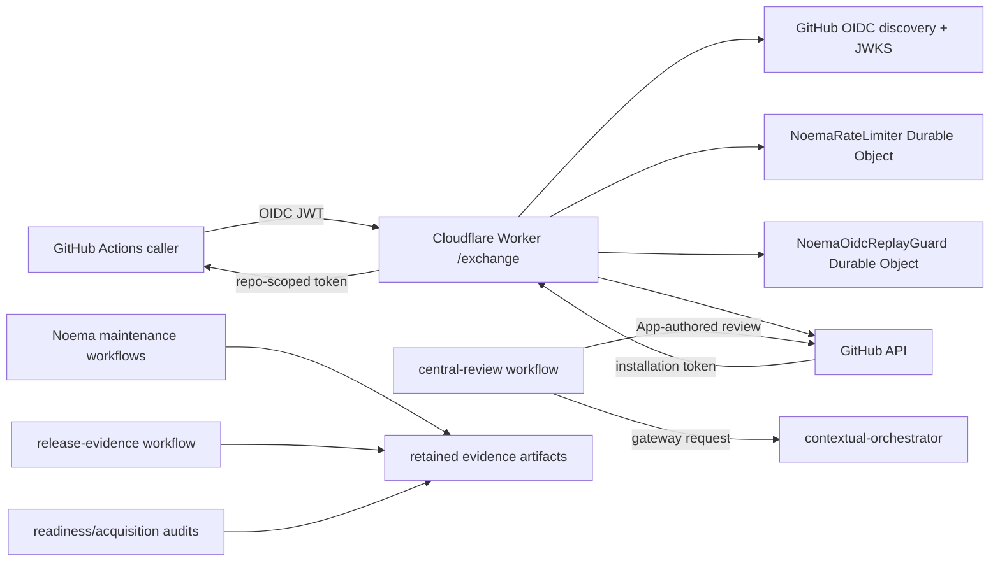
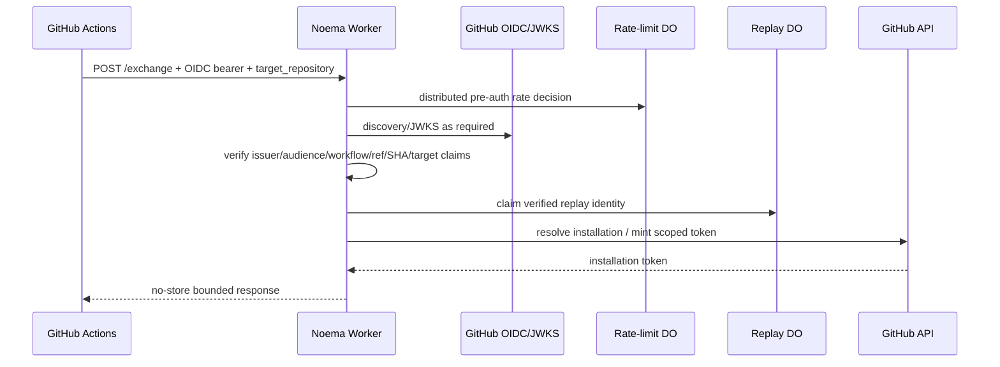

# Noema Architecture

## Status and authority

**Proposed canonical architecture on the current protected lineage.** This document is being rebuilt from protected `main` `382c78f2e9eeac4f24b3a825f192b34943e30c9a`. Until this branch is merged and protected-main acceptance completes, protected source and live governance remain authoritative. Active PR or issue behavior is described as proposed rather than implemented.

Noema is an independent GitHub Actions OIDC-to-GitHub-App capability broker plus repository-owned review, maintenance, release-evidence and commercial-readiness control plane. It must remain usable as a standalone service while composing with ContextualWisdomLab `.github`, `contextual-orchestrator`, `naruon`, and other repositories only through explicit contracts. Those repositories are dependencies, not Noema-owned persistence or write targets.

## Runtime topology



Protected runtime entrypoint is `src/runtime-entrypoint.ts`; Cloudflare configuration binds two SQLite-backed Durable Objects: `NOEMA_RATE_LIMITER` and `NOEMA_OIDC_REPLAY_GUARD`. The configured trust root is GitHub Actions OIDC (`https://token.actions.githubusercontent.com`), audience `cwl-noema-review`, owner `ContextualWisdomLab`, and the reviewed central workflow identity. GitHub App credentials are secrets and are never documentation or evidence payloads.

## Trust and authority planes

Noema deliberately separates the following planes. A PASS in one plane never substitutes for another.

1. **Source identity:** exact commit/head, independently resolved live base, tracked file/blob identity and workflow checkout SHA.
2. **Application verification:** typecheck, realistic tests, exact owned production coverage, package/install-script and reproducibility checks.
3. **Security scanning:** the live central `.github` Security Scan authority. On the current central revision it is eligible only for supported protected bases and hard-gates OSV introduced vulnerabilities, supported dependency review at moderate-or-higher severity, and fixable MEDIUM/HIGH/CRITICAL Trivy findings; Scorecard is posture evidence.
4. **Formal review:** submitted GitHub reviews and unresolved review threads. Model comments, statuses and reactions are not approvals.
5. **Model judgement:** bounded LLM review or proposal evidence. Model-backed development uses `NVIDIA_NIM_API_KEY`, preferably through `contextual-orchestrator`; `COPILOT_GITHUB_TOKEN` is prohibited.
6. **Merge governance:** live rulesets, required workflows and any actually enforced approval rules. The currently observed Noema ruleset requires the central Security Scan workflow and has no bypass actors; it must be refetched before every merge classification.
7. **Release and deployment:** immutable tag/artifact/SBOM/provenance, deployment receipt, environment governance, rollback and protected-source operational evidence.
8. **Commercial/acquisition:** production KPI provenance, customer/revenue evidence, owner/legal rights and transfer evidence. Repository fixtures or prose cannot create this authority.

## Credential exchange sequence



Protected source already contains distributed rate-limit and replay state families. Issue/PR work that changes replay ordering, including the stale Draft lineage represented by #83, remains proposed until rebuilt on and integrated into the current protected source. Architecture text must not promote it early.

## Review and model composition

The repository owns a default-branch `central-review` runtime. It accepts an exact target repository, PR number and PR head SHA; waits for relevant non-OpenCode checks; constructs exact-head context; calls the configured `contextual-orchestrator` gateway; and publishes under a separate Reviewer App identity only after revalidating the live head. Noema does not duplicate upstream provider routing and does not expose provider credentials to untrusted target source.

Model-runner, verifier and credential-bearing publisher responsibilities stay separated. Proposal workflows may produce patches or evidence, but cannot self-approve, merge, release or deploy. No repair/self-modifying workflow is an accepted authority path.

## Repository maintenance and evidence architecture

Repository-owned maintenance is work-conserving and exact-identity bound:

```text
inventory -> exact head/live base -> findings/checks/governance
          -> smallest safe action -> validation -> refetch
          -> next non-conflicting lane
```

Waiting blocks only the exact lane. Stale, predecessor, pending, skipped, neutral, cancelled, failed, absent, rate-limited, status-only and model-only evidence is non-passing.

Current protected truth includes deterministic Node/npm and lifecycle-script/lockfile controls integrated through PR #91, retained deployment byte/path integrity integrated through PR #121, strict KPI provenance-integrity controls integrated through PR #250, and live-governance binding for maintainer readiness integrated through PR #254. Active Drafts such as #252/#253 and maintenance gap #255 are not protected-main truth.

## Persistence model

Noema does **not** currently own a general relational application database. Runtime persistence is limited to Cloudflare Durable Object state for distributed rate limiting and OIDC replay coordination. GitHub PR/review/check/ruleset state, Actions artifacts, release metadata, deployment receipts, production KPI logs and acquisition evidence are external or retained evidence entities.

Therefore the canonical data model is conceptual/logical. A physical SQL ERD would invent persistence that does not exist. If a durable evidence database is later introduced, it requires its own ADR, migration/rollback plan, retention/privacy model and physical schema.

## API and contract boundaries

- `/health` is liveness only.
- `/ready` reports credential-exchange readiness and must fail closed when required runtime binding/configuration is unavailable.
- `/exchange` is POST-only credential exchange with bounded request/response, Bearer challenge semantics, no-store/nosniff responses, exact target-repository validation and non-secret diagnostics.
- `openapi.json`, `docs/api-spec.md` and API stability documentation are machine/human contract surfaces.
- Events between Noema and central workflows are explicit GitHub dispatch/OIDC/check/review contracts, not implicit shared-memory integration.

## Security and privacy invariants

- Never log issued/inbound tokens, App private keys, model credentials or unnecessary personal data.
- Credential-bearing egress is restricted to reviewed destinations and request shapes; redirects and oversized/malformed material fail closed.
- Retained JSON/NDJSON evidence is authenticated from exact bytes where integrity decisions depend on it; malformed UTF-8, ambiguous decoded keys, path/symlink replacement and identity drift must fail closed in their owning validators.
- Checkout credentials are non-persistent on evidence-producing workflows unless an explicit reviewed mutation boundary requires otherwise.
- GitHub Actions are immutable-SHA pinned. Issue #255 tracks migration of remaining `actions/upload-artifact` v4.6.2 pins away from the deprecated Node 20 runtime to a reviewed Node-24-compatible immutable revision.

## Testing and coverage

The protected verification contract requires exact 100% **configured owned production** statement, branch, function and line coverage with realistic tests. This numerical gate is not sufficient when production code is broadly excluded from instrumentation; issue #84 remains the truthfulness gap for broad V8 exclusions in credential-exchange security code and must be resolved only after the shared-source lineage stabilizes. Tests should exercise real `Request`/`Response`, WebCrypto, GitHub/Cloudflare contract behavior and adversarial evidence boundaries where feasible.

## Release, rollback and acquisition boundaries

Release evidence must bind one exact source revision, package/artifact identity, SBOM, provenance, dependency-license/NOTICE evidence and immutable publication. Deployment evidence must separately bind protected environment, exact release, smoke/KPI results and rollback/recovery evidence. Missing real 30-day production KPI provenance, deployment/environment evidence, revenue/customer evidence, owner/legal rights or contributor/IP-transfer evidence remains `NOT_READY`.

Noema automation never selects an outbound license. Public repository visibility, package metadata, SBOM contents or OCI annotations do not create legal authority.

## Canonical documentation graph

This file is the architectural root. The canonical graph is completed by:

- `docs/PRD.md` — product requirements and acceptance semantics;
- `docs/TRD.md` — technical requirements and evidence contracts;
- `docs/UML.md` — component/sequence/state/deployment views;
- `docs/ERD.md` — conceptual/logical state and external-evidence model;
- `docs/adr/` — status-bearing architectural decisions;
- `SECURITY.md` plus runtime/automation threat models;
- `docs/TEST_STRATEGY.md`, `docs/OPERABILITY.md`, release/deployment/provenance documentation;
- `docs/LICENSING_AND_IP_TRANSFER.md` and NOTICE/package evidence;
- `docs/TRACEABILITY.md`, `README.md`, `CLAUDE.md`, `AGENTS.md` and `CHANGELOG.md`.

Where documents disagree, protected code and live external governance win; stale PR prose never overrides current evidence.
