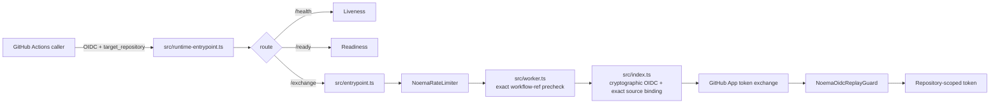
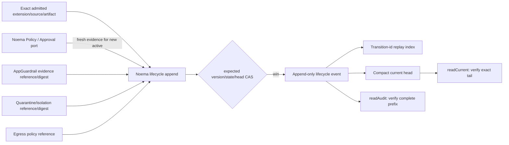

# Noema Architecture & Trust Boundaries

**Status: Code-current canonical architecture for the repository revision that contains it.** Protected source and live GitHub governance remain implementation authority. On protected `main`, this document is protected truth; on an active PR head, behavior that differs from its live protected base remains candidate truth until that revision integrates. **Planned** and **External evidence** claims are labeled explicitly.

Noema is a bounded credential-exchange and automation service. Its core rule is: **verify GitHub Actions OIDC identity, mint a repository-scoped GitHub App installation token, and keep model judgement, review evidence, merge authority, release authority, and deployment authority separate.**

## 1. Protected runtime topology

The Cloudflare Worker is layered:

- `src/runtime-entrypoint.ts` owns `/ready` and delegates ordinary traffic.
- `src/entrypoint.ts` owns outer request and credential-bearing egress validation.
- `src/worker.ts` adds distributed rate limiting, an exact configured workflow-ref precheck, and OIDC replay coordination.
- `src/index.ts` performs cryptographic GitHub Actions OIDC verification and GitHub App installation-token exchange.
- `NoemaRateLimiter` is a SQLite-backed Durable Object for distributed request limiting.
- `NoemaOidcReplayGuard` is a SQLite-backed Durable Object for bounded single-use OIDC replay state.

Wrangler points to `src/runtime-entrypoint.ts` and declares:

```text
NOEMA_RATE_LIMITER      → NoemaRateLimiter
NOEMA_OIDC_REPLAY_GUARD → NoemaOidcReplayGuard
```

Routes have different meanings: `/health` is liveness, `/ready` is offline configuration readiness, and `/exchange` is the credential-bearing exchange API. A healthy process is not automatically ready to exchange credentials.

## 2. Current workflow trust contract

This revision exposes both `ALLOWED_WORKFLOW_REF_PREFIX` and `ALLOWED_WORKFLOW_SHA`. Despite the legacy ref-binding name, `src/worker.ts` parses `ALLOWED_WORKFLOW_REF_PREFIX` as one **exact full workflow ref** and compares decoded `job_workflow_ref` or `workflow_ref` for exact equality. Wildcard, comma, whitespace, and prefix-sharing configuration forms are rejected. `src/runtime-entrypoint.ts` performs readiness dispatch and delegates `/exchange`; `src/entrypoint.ts` applies the distributed rate limiter before `src/worker.ts` performs its denial-only exact workflow-ref precheck. `src/index.ts` independently enforces the exact workflow ref/repository plus immutable `job_workflow_sha` or fallback `workflow_sha` after cryptographic verification. Missing, malformed, mismatched, or non-canonical configured source identity fails closed.

`wrangler.toml` is the canonical repository copy of the currently audited `ALLOWED_WORKFLOW_SHA`; this architecture document deliberately does not duplicate that mutable 40-character value. GitHub OIDC `job_workflow_sha` binds the caller to the exact protected central `.github` repository commit selected by `refs/heads/main`, not merely to the bytes of one workflow file. Therefore every protected central ref movement requires a fresh comparison before Noema may move the runtime trust pin, even when the intervening commit changes only unrelated files. The audit must compare the new protected source tip, the trusted `noema-review.yml` workflow, the review-gate implementation it invokes, central Security Scan authority, and the intervening source-tree delta. Audit-specific SHAs and file deltas belong in the active PR/review evidence rather than this canonical architecture document so later unrelated central commits cannot silently make architecture prose stale. The current central Noema workflow must continue to resolve its trusted source to an immutable workflow commit before materialization, reject stale pull-request heads before credential/model setup, and keep model evaluation separate from publication. Noema advances or rolls back its repository-commit trust pin only after those checks succeed.

The central repository remains a read-only dependency from Noema. A central OIDC consumer mismatch, reviewer-token lifecycle defect, or scanner-control defect remains central-owned: Noema does not weaken or reshape its producer envelope, reviewer boundary, or source-authentication semantics to compensate for a foreign consumer/control-plane defect.

The configured workflow ref and source SHA are operator authority bytes, not normalization input. The protected workflow-ref parser and authoritative verifier do not trim whitespace from these trust values before validation/comparison. A whitespace-bearing value therefore fails as unusable configuration rather than being normalized into a different trusted identity. On an active PR head this statement is candidate truth if the corresponding source delta is not yet on the live protected base.

The worker exact-ref precheck is not an authorization substitute for cryptographic verification. `/exchange` requests reach distributed rate limiting before unverified workflow-source claims can affect trust rejection; immutable source-SHA authority is enforced by the authoritative verifier after signature and claim verification. The remaining issuer, audience, repository, time-window, replay, and GitHub App boundaries remain independent and fail closed at their owning layer.

## 3. Runtime data flow



Each boundary is fail-closed where its owning implementation requires a control. Success at an earlier boundary never proves a later one.

## 4. Optional CWL composition

Noema remains independently deployable. CWL composition is through versioned protocol/evidence contracts rather than shared process or database state.

- `ContextualWisdomLab/.github` may own central reusable workflow policy.
- `contextual-orchestrator` owns model routing/orchestration behind its published gateway contract.
- `naruon` may consume Noema contracts, but Noema does not require naruon persistence, runtime, or deployment lifecycle.

These are separate ownership domains. Noema does not duplicate their internal authority.

This revision adds a candidate Tool / Capability admission port at `src/tool-capability/external-extension-admission.ts` for external Claude community plugins. It is not an HTTP route and does not change `/health`, `/ready`, or `/exchange`. Marketplace discovery, Anthropic review, and plugin packaging are not runtime authority. The port stays a local fail-closed ACL until an immutable `context-graph-contracts` artifact contract exists.

Protected source includes the durable lifecycle aggregate behind that admission boundary without expanding foreign ownership. `src/tool-capability/external-extension-lifecycle-store.ts` partitions one event stream by the complete exact extension/source/artifact identity and persists Noema lifecycle transition/version/head authority plus immutable Policy / Approval, AppGuardrail, quarantine/isolation, and Egress references/digests. It does not persist mutable scanner verdicts, quarantine runtime truth, outbound policy bodies, provider routing, raw secrets, product payloads, or hidden reasoning.



The arrows from foreign owners carry immutable evidence identities only. Noema does not become their source of truth.

### 4.1 Protected procedural graph guidance

Protected source includes a library-only Agent Runtime aggregate for bounded procedural guidance. `src/agent-runtime/procedural-graph.ts` admits one immutable tenant/task/graph snapshot, canonicalizes nodes and directed relationships, computes local content/structure digests, and pins a module-admitted session to one canonical execution identity. `src/agent-runtime/procedural-evolution.ts` screens a direct child graph against paired held-out evidence but always returns `activationAuthorized: false`; eligibility is evidence for a later independent approval boundary, not permission to publish or execute a graph. `src/agent-runtime/procedural-execution.ts` additionally projects guidance only when its caller supplies a fresh authenticated `running` lifecycle snapshot for the same execution identity; it does not itself become durable lifecycle or revocation authority.

Protected source `src/agent-runtime/procedural-current-lifecycle.ts` provides a workflow-backed current-state ACL over the existing execution-scoped Workflow / Task Execution Durable Object. The ACL re-admits the workflow plan and validates the locally admitted procedural session against the same canonical execution identity before it selects or reads any Durable Object. It then performs the existing private workflow-state `read`, validates current execution/plan/task/cancellation evidence, and projects only a conservative Agent Runtime lifecycle state into the already-protected running-only procedural gate. Current cancellation, terminal work and pre-start evidence suppress guidance. The ACL cannot mutate workflow state, create lifecycle transitions or retries, grant tools or Policy / Approval, or authorize graph activation.

The aggregate deliberately owns only Noema runtime mechanics. Procedural text is inert advisory data and is not tool authority, Policy / Approval, a prompt-injection verdict, a secret/PII scrubber, or product-domain truth. Graph/session WeakSet admission prevents structural lookalikes from becoming local runtime capabilities. Unknown procedures and context-budget overflow abstain without a hidden full-graph fallback. Execution identities reuse the canonical Agent Runtime grammar rather than defining a second identity domain.

Protected source also binds paired evaluation receipts and evaluator/profile context into canonical evaluation identities, verifies a separately authenticated P-256 ECDSA evaluator handoff selected by the composition root, and binds rejection/disposition semantics into the signed claim identity. The verifier does not discover, rotate, store, or administer signer keys. Protected #597 adds bounded durable evaluation/rejection history under the existing State / Checkpoint boundary with monotonic CAS, exact replay, digest-chain integrity, duplicate-handoff refusal, restart reconstruction, and fail-closed bounded capacity. The retained history is evidence state only; it does not become Policy / Approval, graph publication, lifecycle, or activation authority.

Protected #601 adds a separate Noema Policy / Approval CAS ledger. It consumes only a repository-admitted current State / Checkpoint snapshot plus an independently supplied exact policy decision and binds the graph, evaluation-history position, evaluator handoff and expected approval version into an append-only digest chain. `approve_for_pilot` requires the latest evaluation to remain `eligibleForApproval` with `validation_non_regression`; explicit `revoke` may bind a newer authenticated regression history, but only from an already-approved prior state. Exact decision replay is idempotent, stale writers fail the monotonic approval-version CAS, and every retained event/snapshot remains `activationAuthorized:false`. This is point-in-time approval evidence, not graph publication or activation authority.

Cross-product ownership remains outside this protected advisory boundary: released wire contracts belong to `context-graph-contracts`, enterprise adoption/decision records to `enterprise-architecture-core`, model routing to `contextual-orchestrator`, credentials and live signer trust selection to Keyverse/owner composition, and graph content/evaluation outcome truth to the owning product. Mutable sibling PR heads are not consumed. ADR 0017 remains `Proposed`; protected source integration does not establish live trust selection, non-workflow current-lifecycle revocation, deployed Durable Object behavior/performance, fresh publication-time State / Checkpoint plus Policy / Approval reconciliation, graph publication, canary/rollback evidence, production activation, or organization-wide self-evolution.

## 5. Evidence and authority separation

| Plane | Meaning | Not equivalent to |
| --- | --- | --- |
| runner assignment | job obtained execution capacity | check success, approval, merge |
| check runs | CI/security result | formal approval |
| commit statuses | integration status | check run or approval |
| review evidence | formal/commented review state | merge permission by itself |
| model judgement | LLM assessment | independent approval or source truth |
| live ruleset | repository governance | source correctness |
| merge authority | permission after live gates | release/deployment authority |
| release authority | version/artifact publication | deployment success |
| deployment authority | production/environment control | buyer/legal evidence |

Queued, pending, skipped-required, cancelled, failed, stale-head, predecessor-head, synthetic-only, status-only, and model-only evidence is non-passing for a gate requiring terminal current evidence.

## 6. exact-head and live-base invariants

Repository automation must:

1. bind source review and CI claims to the **exact-head** SHA;
2. resolve the live base independently instead of treating historical PR-base metadata as the protected tip;
3. refetch mutable targets immediately before writes;
4. keep check runs, commit statuses, review evidence, scanner evidence, and model judgement separate;
5. fully paginate evidence before claiming completeness;
6. reject stale/predecessor evidence as current success;
7. avoid self-modifying repair workflows and never weaken gates to manufacture green evidence.

These control-plane invariants are separate from the runtime OIDC trust contract. Immutable workflow-source identity is already protected-base truth at this revision's branch point; active-PR changes described here remain candidate truth until their exact revision integrates.

## 7. Credential and network boundaries

Worker runtime secrets enter `src/` through typed Cloudflare bindings, including `GITHUB_APP_ID`, `GITHUB_APP_PRIVATE_KEY_PEM`, and optional `GITHUB_APP_INSTALLATION_ID`. Production code does not gain ambient secret reads through `process.env` or `os.getenv()`.

Credential-bearing GitHub traffic uses bounded origin/request/response validation. OIDC discovery/JWKS traffic is public verification traffic and does not carry GitHub App credentials. Unexpected redirect/origin/path/method, unbounded bodies, malformed upstream responses, and timeouts fail closed at their owning boundary.

Model-facing automation uses the `NOEMA_LLM_*` gateway contract where applicable. Upstream provider credentials stay behind `contextual-orchestrator`; reviewer and repository-write credentials remain separate from model execution authority. `COPILOT_GITHUB_TOKEN` is not a substitute.

## 8. Durable state and time

`NoemaRateLimiter` and `NoemaOidcReplayGuard` own different minimal state. Raw credentials are not their persistence model. Missing or malformed backend decisions fail closed where the control is required.

Durable Object alarms are at-least-once. Handlers reread current deadline/expiry state and **reschedule** from current state so delayed alarms cannot delete newer state. Storage-class, binding-name, or lifecycle changes require migration/rollback analysis.

Protected source includes separate Durable Object storage semantics for external-extension lifecycle evidence. The event log is append-only and is not the bounded Workflow / Task receipt ledger. Event/request digests are computed outside the short transaction; the transaction revalidates expected version, prior state, and prior head digest before atomically writing event + idempotency index + compact head. `readCurrent()` verifies only the head and exact tail for the latency-sensitive path, whereas `readAudit()` verifies every retained version/hash link and final head/tail identity. Corrupt or truncated durable state is a conflict, never an empty stream. Recovery and rollback must preserve acknowledged history and follow `docs/external-extension-lifecycle-recovery.md`.

Procedural graph/session and candidate-decision authority remain process-local immutable values. In contrast, protected #597 owns bounded durable evaluation/rejection history under the existing State / Checkpoint boundary. It persists only admitted graph/evaluation/authenticated signed-claim identities and payload-minimized rejection evidence, validates monotonic CAS and exact replay, verifies the retained digest chain, reconstructs after restart, rejects duplicate handoff identity, and fails closed at its bounded capacity instead of silently evicting evidence. A retained history event is not retained activation or approval authority by itself: protected #601 separately owns the Noema Policy / Approval CAS ledger, while live signer trust, graph publication, non-workflow lifecycle freshness/revocation, canary/rollback and product-owner outcome evidence remain separate owner-controlled boundaries.

Protected #601 records only exact Noema Policy / Approval decision state. Its retained event chain is keyed to the admitted graph lineage and binds current State / Checkpoint history identity, authenticated evaluator handoff identity and expected approval version. It does not own Keyverse keys, product-domain truth, graph publication, tool invocation, provider routing or activation. Because State / Checkpoint may advance after an approval transaction, publication/activation must freshly read and compare both current authorities rather than treating a prior CAS success as indefinitely current.

Protected #589 separately reuses the existing durable Workflow / Task Execution state only as current task/cancellation evidence for workflow-backed advisory gating. It does not create another lifecycle store and does not turn Workflow / Task Execution into procedural-history authority. This separation keeps State / Checkpoint evidence retention, Workflow / Task current execution truth, Policy / Approval, and product-domain ownership distinct.

## 9. Standalone and modular MSA contract

- **Standalone first:** Noema can deploy, roll back, expose readiness, and serve its core API without another CWL service.
- **Protocol composition:** integrations use documented API/event/evidence contracts, not cross-service application-table SQL.
- **No shared-secret coupling:** provider/reviewer secrets stay in their owning trust domain.
- **Independent failure domains:** orchestration or reviewer failure cannot relax credential verification.
- **Versioned evidence:** machine-readable evidence names producer/schema/source identity without implying extra authority.
- **Data design:** new owned relational objects use descriptive two-or-more-word `snake_case` names and 3NF by default.

## 10. Verification by change family

| Change | Minimum proof |
| --- | --- |
| `/exchange` | typecheck, realistic public/API regressions, exact owned-production coverage, security scan |
| OIDC/GitHub App | issuer/audience/repository/workflow-ref, immutable workflow-source SHA when configured, malformed token/JWKS, replay, redirect/egress, secret non-disclosure regressions |
| Durable Objects | cross-instance semantics, delayed/retried alarm, current-state reschedule, malformed backend/storage-failure tests |
| External-extension lifecycle | legal-edge validation; restart/replay/CAS races; exact Policy / Approval and foreign-owner reference binding; corruption/truncation/cross-stream rejection; >128-transition auditability; O(1) verified current projection; full audit/recovery rehearsal; actual Durable Object p95/contention/storage-growth evidence before runtime acceptance |
| Procedural graph guidance | exact schema/identity bounds; graph/session local admission; canonical digest behavior; cycle-safe bounded neighborhood extraction; unknown/budget abstention; paired holdout separation and exact candidate/base/context binding; safety and measured-score non-regression; `activationAuthorized: false`; exact receipt/envelope and authenticated evaluator-handoff binding; durable history CAS/replay/integrity/restart/capacity; pure same-execution fresh lifecycle projection; workflow-backed plan/session identity rejection before durable lookup plus fresh current Workflow / Task Execution read per decision; Policy / Approval CAS approval/revocation and replay/CAS integrity; live trust selection/non-workflow revocation/deployed-DO/fresh publication-time cross-authority reconciliation/graph-publication/canary evidence before activation |
| GitHub Actions/control plane | least privilege, exact-head/live-base binding, full pagination, stale-head refusal, evidence-class separation |
| LLM integration | gateway contract, provider-key isolation, deterministic gates independent of model judgement |
| release/acquisition | protected source, CI/security/coverage, package/SBOM/provenance/reproducibility, licensing/NOTICE, rollback/recovery, later operational/buyer evidence |

Owned production remains subject to exact 100% statement/branch/function/line coverage where tooling exposes those metrics. Coverage exclusions do not substitute for executable behavior tests.

## 11. Independent gates and non-claims

Repository source/docs cannot fabricate stronger live `main` governance than the current ruleset, independent approval, App provisioning, reviewer staffing, protected production approval, immutable release/signing/provenance, 30-day KPI evidence, customer/revenue evidence, or legal transfer authority. These remain separate evidence classes and fail closed when required but absent.

Protected external-extension lifecycle source cannot establish actual Durable Object p95, contention/partition behavior, backup/restore success, production recovery, or deployed invocation enforcement by documentation alone. Those remain later exact operational evidence.

Protected procedural-graph source can authenticate the supplied evaluator assertion, retain bounded evaluation/rejection history, and record source-level Policy / Approval CAS decisions through protected #601, but it cannot establish live signer/trust selection, cross-language/released digest semantics, non-workflow current-lifecycle revocation, deployed Workflow / Task, history-store or Policy / Approval behavior/performance, fresh publication-time reconciliation, graph publication, canary operation, rollback success, or production outcome improvement. Those remain later owner, contract, operational, and product-owner evidence.

## 12. Canonical documentation graph

- `docs/PRD.md`, `docs/TRD.md`
- `docs/adr/README.md`
- `docs/UML.md`, `docs/ERD.md`
- `docs/TEST_STRATEGY.md`, `docs/OPERABILITY.md`
- `docs/external-extension-lifecycle-recovery.md`
- `docs/TRACEABILITY.md`
- `docs/product-technical-gap-baseline.md`
- protected `openapi.json` and `docs/api-spec.md`
- `docs/threat-model.md`, `docs/automation-threat-model.md`
- `docs/LICENSING_AND_IP_TRANSFER.md`
- `docs/DOCUMENTATION_GAP_AUDIT.md`
- `docs/doctoring/architecture-trust-boundaries.md`

Root README/customer copy may have a separate active owner; the canonical architecture graph must not race that owner merely to satisfy historical wording assertions.

## 13. Architectural decision

The default shape is **small credential-exchange service + explicit state coordinators + external orchestration/review planes**. New model orchestration, artifact processing, repository mutation, or deployment authority should first be evaluated as a separate bounded component rather than folded into `/exchange`.

The external-extension lifecycle remains a bounded Tool Capability / State / Checkpoint aggregate rather than a new scanner, quarantine runtime, egress engine, identity provider, or model router. Its synchronous projection path and full audit/recovery path are deliberately separate so buyer/runtime latency does not require scanning retained history while recovery still verifies the complete chain.

The protected procedural-graph advisory remains a bounded Agent Runtime aggregate rather than an execution engine or autonomous policy plane. Its pure execution adapter may project localized context against a caller-supplied fresh authenticated same-execution `running` lifecycle snapshot. Protected #589 adds only a workflow-backed current-state ACL over the existing canonical Workflow / Task Execution owner. Protected #597 adds a separate bounded State / Checkpoint history for evaluation/rejection evidence, not a second Workflow / Task or lifecycle truth. Protected #601 adds the distinct Noema Policy / Approval CAS ledger without granting publication or activation. Any future release, live signer-trust selection, graph publication, non-workflow current-lifecycle revocation, publication-time cross-authority reconciliation, canary, or activation path must cross explicit versioned owner contracts and retain `activationAuthorized:false` until those independent authorities are proven.

Architecture changes must keep source behavior, realistic regression tests, canonical documentation, traceability, and CHANGELOG semantics consistent without promoting active-PR behavior to protected truth.
