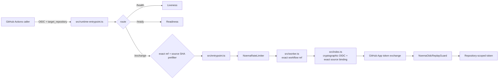

# Noema Architecture & Trust Boundaries

**Status: Code-current canonical architecture for the repository revision that contains it.** Protected source and live GitHub governance remain implementation authority. On protected `main`, this document is protected truth; on an active PR head, behavior that differs from its live protected base remains candidate truth until that revision integrates. **Planned** and **External evidence** claims are labeled explicitly.

Noema is a bounded credential-exchange and automation service. Its core rule is: **verify GitHub Actions OIDC identity, mint a repository-scoped GitHub App installation token, and keep model judgement, review evidence, merge authority, release authority, and deployment authority separate.**

## 1. Protected runtime topology

The Cloudflare Worker is layered:

- `src/runtime-entrypoint.ts` owns `/ready` and delegates ordinary traffic.
- `src/entrypoint.ts` owns outer request and credential-bearing egress validation.
- `src/worker.ts` adds distributed rate limiting, an exact configured workflow-ref precheck, and OIDC replay coordination.
- `src/index.ts` performs cryptographic GitHub Actions OIDC verification and GitHub App installation-token exchange.
- `NoemaRateLimiter` is a SQLite-backed Durable Object for distributed request limiting.
- `NoemaOidcReplayGuard` is a SQLite-backed Durable Object for bounded single-use OIDC replay state.

Wrangler points to `src/runtime-entrypoint.ts` and declares:

```text
NOEMA_RATE_LIMITER      → NoemaRateLimiter
NOEMA_OIDC_REPLAY_GUARD → NoemaOidcReplayGuard
```

Routes have different meanings: `/health` is liveness, `/ready` is offline configuration readiness, and `/exchange` is the credential-bearing exchange API. A healthy process is not automatically ready to exchange credentials.

## 2. Current workflow trust contract

This revision exposes both `ALLOWED_WORKFLOW_REF_PREFIX` and `ALLOWED_WORKFLOW_SHA`. Despite the legacy ref-binding name, `src/worker.ts` parses `ALLOWED_WORKFLOW_REF_PREFIX` as one **exact full workflow ref** and compares decoded `job_workflow_ref` or `workflow_ref` for exact equality. Wildcard, comma, whitespace, and prefix-sharing configuration forms are rejected. `src/runtime-entrypoint.ts` performs an early denial-only source check, while `src/index.ts` independently enforces the exact workflow ref/repository plus immutable `job_workflow_sha` or fallback `workflow_sha` after cryptographic verification. Missing, malformed, mismatched, or non-canonical configured source identity fails closed.

`wrangler.toml` pins `ALLOWED_WORKFLOW_SHA` to the central `.github` commit `d2c554dbbc04854db6215970fabb70cef1ceb690`. That repository remains a read-only dependency from Noema; a future central source revision requires an explicit Noema trust roll-forward and fresh exact-head evidence.

The configured workflow ref and source SHA are operator authority bytes, not normalization input. The runtime prefilter, protected workflow-ref parser, and authoritative verifier do not trim whitespace from these trust values before validation/comparison. A whitespace-bearing value therefore fails as unusable configuration rather than being normalized into a different trusted identity. On an active PR head this statement is candidate truth if the corresponding source delta is not yet on the live protected base.

The source-SHA prefilter is not an authorization substitute for cryptographic verification. Tokens not rejected at the wrapper continue through the existing distributed rate-limit, exact-ref trust, signature, issuer, audience, repository, time-window, replay, and GitHub App boundaries.

## 3. Runtime data flow



Each boundary is fail-closed where its owning implementation requires a control. Success at an earlier boundary never proves a later one.

## 4. Optional CWL composition

Noema remains independently deployable. CWL composition is through versioned protocol/evidence contracts rather than shared process or database state.

- `ContextualWisdomLab/.github` may own central reusable workflow policy.
- `contextual-orchestrator` owns model routing/orchestration behind its published gateway contract.
- `naruon` may consume Noema contracts, but Noema does not require naruon persistence, runtime, or deployment lifecycle.

These are separate ownership domains. Noema does not duplicate their internal authority.

## 5. Evidence and authority separation

| Plane | Meaning | Not equivalent to |
| --- | --- | --- |
| runner assignment | job obtained execution capacity | check success, approval, merge |
| check runs | CI/security result | formal approval |
| commit statuses | integration status | check run or approval |
| review evidence | formal/commented review state | merge permission by itself |
| model judgement | LLM assessment | independent approval or source truth |
| live ruleset | repository governance | source correctness |
| merge authority | permission after live gates | release/deployment authority |
| release authority | version/artifact publication | deployment success |
| deployment authority | production/environment control | buyer/legal evidence |

Queued, pending, skipped-required, cancelled, failed, stale-head, predecessor-head, synthetic-only, status-only, and model-only evidence is non-passing for a gate requiring terminal current evidence.

## 6. exact-head and live-base invariants

Repository automation must:

1. bind source review and CI claims to the **exact-head** SHA;
2. resolve the live base independently instead of treating historical PR-base metadata as the protected tip;
3. refetch mutable targets immediately before writes;
4. keep check runs, commit statuses, review evidence, scanner evidence, and model judgement separate;
5. fully paginate evidence before claiming completeness;
6. reject stale/predecessor evidence as current success;
7. avoid self-modifying repair workflows and never weaken gates to manufacture green evidence.

These control-plane invariants are separate from the runtime OIDC trust contract. Immutable workflow-source identity is already protected-base truth at this revision's branch point; the active source delta represented by this file strengthens only canonical configuration-byte handling until that delta integrates.

## 7. Credential and network boundaries

Worker runtime secrets enter `src/` through typed Cloudflare bindings, including `GITHUB_APP_ID`, `GITHUB_APP_PRIVATE_KEY_PEM`, and optional `GITHUB_APP_INSTALLATION_ID`. Production code does not gain ambient secret reads through `process.env` or `os.getenv()`.

Credential-bearing GitHub traffic uses bounded origin/request/response validation. OIDC discovery/JWKS traffic is public verification traffic and does not carry GitHub App credentials. Unexpected redirect/origin/path/method, unbounded bodies, malformed upstream responses, and timeouts fail closed at their owning boundary.

Model-facing automation uses the `NOEMA_LLM_*` gateway contract where applicable. Upstream provider credentials stay behind `contextual-orchestrator`; reviewer and repository-write credentials remain separate from model execution authority. `COPILOT_GITHUB_TOKEN` is not a substitute.

## 8. Durable state and time

`NoemaRateLimiter` and `NoemaOidcReplayGuard` own different minimal state. Raw credentials are not their persistence model. Missing or malformed backend decisions fail closed where the control is required.

Durable Object alarms are at-least-once. Handlers reread current deadline/expiry state and **reschedule** from current state so delayed alarms cannot delete newer state. Storage-class, binding-name, or lifecycle changes require migration/rollback analysis.

## 9. Standalone and modular MSA contract

- **Standalone first:** Noema can deploy, roll back, expose readiness, and serve its core API without another CWL service.
- **Protocol composition:** integrations use documented API/event/evidence contracts, not cross-service application-table SQL.
- **No shared-secret coupling:** provider/reviewer secrets stay in their owning trust domain.
- **Independent failure domains:** orchestration or reviewer failure cannot relax credential verification.
- **Versioned evidence:** machine-readable evidence names producer/schema/source identity without implying extra authority.
- **Data design:** new owned relational objects use descriptive two-or-more-word `snake_case` names and 3NF by default.

## 10. Verification by change family

| Change | Minimum proof |
| --- | --- |
| `/exchange` | typecheck, realistic public/API regressions, exact owned-production coverage, security scan |
| OIDC/GitHub App | issuer/audience/repository/workflow-ref, immutable workflow-source SHA when configured, malformed token/JWKS, replay, redirect/egress, secret non-disclosure regressions |
| Durable Objects | cross-instance semantics, delayed/retried alarm, current-state reschedule, malformed backend/storage-failure tests |
| GitHub Actions/control plane | least privilege, exact-head/live-base binding, full pagination, stale-head refusal, evidence-class separation |
| LLM integration | gateway contract, provider-key isolation, deterministic gates independent of model judgement |
| release/acquisition | protected source, CI/security/coverage, package/SBOM/provenance/reproducibility, licensing/NOTICE, rollback/recovery, later operational/buyer evidence |

Owned production remains subject to exact 100% statement/branch/function/line coverage where tooling exposes those metrics. Coverage exclusions do not substitute for executable behavior tests.

## 11. Independent gates and non-claims

Repository source/docs cannot fabricate stronger live `main` governance than the current ruleset, independent approval, App provisioning, reviewer staffing, protected production approval, immutable release/signing/provenance, 30-day KPI evidence, customer/revenue evidence, or legal transfer authority. These remain separate evidence classes and fail closed when required but absent.

## 12. Canonical documentation graph

- `docs/PRD.md`, `docs/TRD.md`
- `docs/adr/README.md`
- `docs/UML.md`, `docs/ERD.md`
- `docs/TEST_STRATEGY.md`, `docs/OPERABILITY.md`
- `docs/TRACEABILITY.md`
- protected `openapi.json` and `docs/api-spec.md`
- `docs/threat-model.md`, `docs/automation-threat-model.md`
- `docs/LICENSING_AND_IP_TRANSFER.md`
- `docs/DOCUMENTATION_GAP_AUDIT.md`
- `docs/doctoring/architecture-trust-boundaries.md`

Root README/customer copy may have a separate active owner; the canonical architecture graph must not race that owner merely to satisfy historical wording assertions.

## 13. Architectural decision

The default shape is **small credential-exchange service + explicit state coordinators + external orchestration/review planes**. New model orchestration, artifact processing, repository mutation, or deployment authority should first be evaluated as a separate bounded component rather than folded into `/exchange`.

Architecture changes must keep source behavior, realistic regression tests, canonical documentation, traceability, and CHANGELOG semantics consistent without promoting active-PR behavior to protected truth.
