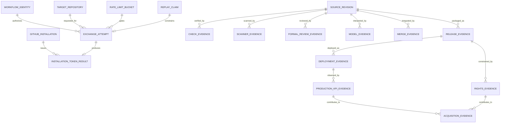

# Noema Conceptual and Logical Data Model

## Status

**Proposed canonical data model rebuilt from protected `main` `382c78f2e9eeac4f24b3a825f192b34943e30c9a`.** This document does not create storage. Protected source and live platform state remain authoritative until this branch integrates.

## Persistence truth

Noema does **not** currently own a general-purpose relational application database. The only repository-declared persistent runtime state is Cloudflare Durable Object state for:

- `NoemaRateLimiter` via binding `NOEMA_RATE_LIMITER`; and
- `NoemaOidcReplayGuard` via binding `NOEMA_OIDC_REPLAY_GUARD`.

Both are declared with SQLite-backed Durable Object storage in `wrangler.toml`. GitHub pull requests, reviews, checks, rulesets, workflow runs, releases, Actions artifacts, Cloudflare deployment records, KPI source logs, revenue evidence and legal/IP evidence remain external evidence systems. A physical SQL ERD for those entities would invent persistence Noema does not own.

## Conceptual model



The diagram is conceptual: only rate-limit/replay coordination is Noema-owned Durable Object persistence. Other entities are external or retained evidence records and must not be presented as one transactional database.

## Logical runtime state

### Rate-limit state

Logical identity:

```text
rate_limit_scope_key
window_started_at
request_count
limit_per_minute
```

Required semantics:

- scope/key derivation is bounded and non-secret;
- updates coordinate across Worker isolates;
- malformed or unavailable distributed decisions fail closed;
- expiration/window rollover is deterministic;
- local in-process limiting is defense in depth and not the distributed authority.

Exact physical tables/columns are implementation details of the Durable Object and must be documented only when current source declares them. This canonical model intentionally does not invent names absent from protected implementation.

### OIDC replay state

Logical identity:

```text
verified_replay_identity
claim_expiry
claim_state
```

Required semantics:

- replay state is keyed only from verified/authorized OIDC material, never an untrusted payload claim;
- a conflicting prior claim fails closed;
- unavailable/malformed replay storage fails closed;
- expiry is bounded to the authenticated token lifetime/contract;
- current protected ordering is determined by source. Proposed replay-before-token-mint work under issue #81 / stale Draft #83 is not represented as already integrated.

Again, physical schema names are intentionally omitted unless current source owns and exposes them as a stable migration contract.

## External evidence entities

### Source revision

Canonical fields when retained as evidence:

```text
repository_full_name
head_sha
base_ref
base_sha
workflow_ref
workflow_checkout_sha
observed_at
```

A branch name without an immutable SHA is insufficient for privileged decisions. PR-head identity, independently resolved live base, and synthetic merge revisions remain distinct.

### Check evidence

```text
repository_full_name
source_sha
check_name
workflow_run_id
workflow_job_id
checkout_sha
status
conclusion
observed_at
```

Check evidence does not contain formal review or merge authority.

### Scanner evidence

```text
repository_full_name
source_sha
base_sha
scanner_authority_revision
scanner_kind
threshold_or_policy
status
conclusion
observed_at
```

Central Security Scan absence on an ineligible feature base is non-passing; it is not equivalent to a successful scan.

### Formal review evidence

```text
repository_full_name
pull_request_number
source_sha
reviewer_identity
review_state
submitted_at
unresolved_thread_count
```

Model comments, commit statuses, reactions and bot-looking identities are not formal approval.

### Model evidence

```text
repository_full_name
source_sha
model_route
bounded_result_identity
status
observed_at
```

Model evidence has no merge/release/deployment authority. Provider credentials are never retained in this entity.

### Merge evidence

```text
repository_full_name
pull_request_number
merged_head_sha
live_base_sha
merge_commit_sha
ruleset_identity
required_workflow_identity
merged_at
```

Merge evidence must be produced from current live governance and the unchanged accepted head.

### Release evidence

```text
repository_full_name
source_sha
release_tag
package_version
artifact_sha256
artifact_bytes
sbom_identity
provenance_identity
publication_receipt
```

One exact release identity must bind all retained technical evidence. A successful CI run is not a release receipt.

### Deployment evidence

```text
repository_full_name
source_sha
release_tag
artifact_sha256
environment_identity
deployment_receipt
smoke_evidence_identity
rollback_evidence_identity
observed_at
```

Protected environment governance and deployment approval are external controls and must be independently observed.

### Production KPI evidence

```text
source_kind
source_id
records
collected_at
log_sha256
log_bytes
window_days
failure_rate
p95_latency_ms
```

Protected source contains exact-byte/provenance integrity controls integrated through PR #250. Real >=30-day production data is still absent under issue #3 and must not be replaced by fixtures.

### Rights/IP evidence

```text
owner_authority
source_documents
outbound_license_decision
contributor_rights_provenance
third_party_obligations
artifact_rights_metadata
updated_at
```

`outbound_license_decision` is intentionally nullable/not-authorized until owner/legal evidence exists. Repository visibility, package metadata, SBOM or OCI annotations cannot populate this field by inference.

### Acquisition evidence

```text
technical_readiness
production_readiness
release_deployment_readiness
customer_revenue_evidence
rights_transfer_evidence
final_gate_status
missing_required_evidence
```

`final_gate_status` must be recomputed from authenticated evidence; persisted green booleans are not authority. Current real-world gaps keep this status `NOT_READY`.

## Authority relationships

Noema must never collapse these independent relationships into one generic `status` table:

```text
source identity
  != application check
  != security scanner
  != formal review
  != model judgement
  != merge authority
  != release
  != deployment
  != production KPI
  != legal/IP rights
  != acquisition readiness
```

A consumer may aggregate them into a report only if every component remains individually attributable and missing/non-passing evidence stays visible.

## Privacy and retention

- Never persist raw OIDC bearer tokens, GitHub installation tokens, App private keys, provider keys or unrelated environment secrets.
- Do not retain unnecessary personal data about reviewers, reporters or customers in public artifacts.
- Security/vulnerability case material stays in approved private systems; public acquisition evidence should retain only the minimum control proof.
- Operational evidence retention must follow the owning runbook and legal-hold requirements; this document does not invent retention periods absent an approved policy.

## Schema evolution

A future general evidence database requires a status-bearing ADR before implementation covering:

1. ownership and threat model;
2. conceptual/logical-to-physical mapping;
3. migration/rollback and backup/recovery;
4. retention/privacy/deletion/legal hold;
5. consistency/idempotency/concurrency contracts;
6. exact release/deployment compatibility;
7. buyer/export/transfer format;
8. physical schema and indexes.

Until that decision exists, this conceptual/logical model is intentionally the highest data-model authority.

## Related authority

- `ARCHITECTURE.md`
- `docs/PRD.md`
- `docs/TRD.md` once current-main convergence is accepted
- `wrangler.toml`
- `docs/api-spec.md` and `openapi.json`
- `SECURITY.md` and threat-model documents
- release/deployment/KPI/acquisition evidence documentation
- `docs/TRACEABILITY.md` once current-main convergence is accepted
