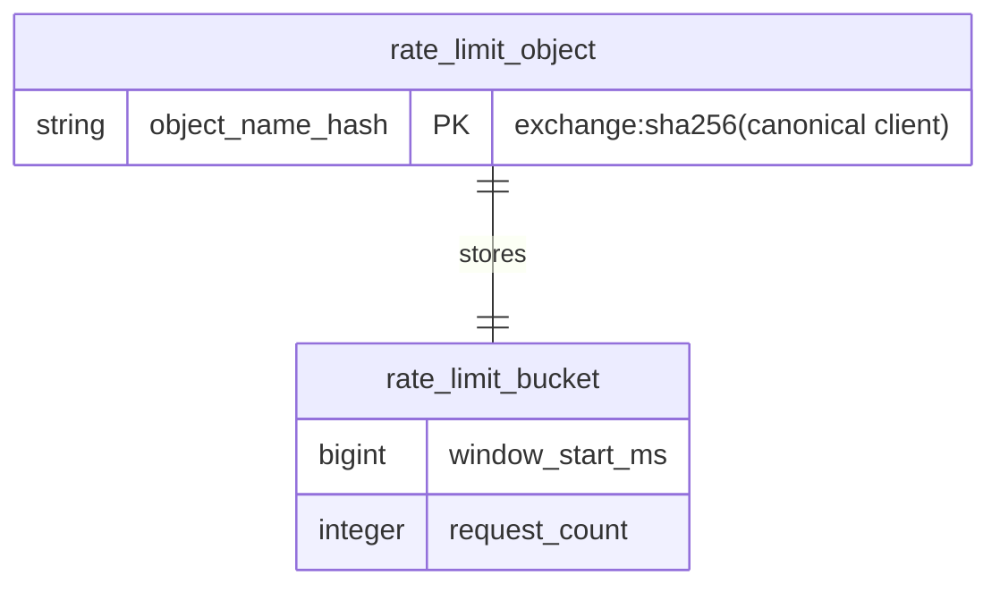
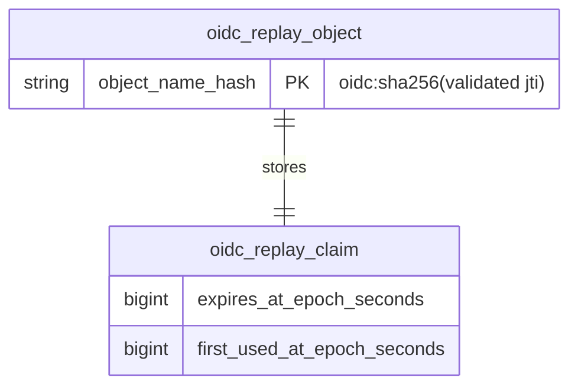
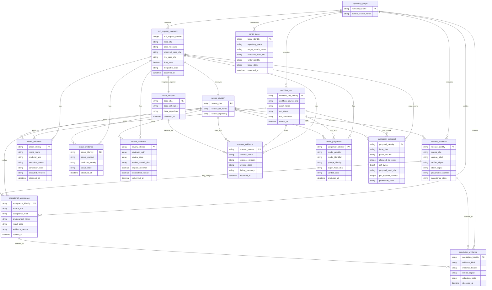

# Noema ERD and Evidence Domain Model

## Scope and interpretation

Noema는 현재 전통적인 application relational database를 운영하지 않습니다. 따라서 이 문서는 두 모델을 명확히 분리합니다.

1. **Persisted runtime model** — Cloudflare Durable Object storage에 실제로 저장되는 최소 상태.
2. **Conceptual model** — GitHub/API/artifact에서 관측되는 evidence와 control entity의 의미 관계. 이 entity들이 현재 하나의 PostgreSQL schema에 영속된다고 주장하지 않습니다.

향후 evidence store를 추가한다면 conceptual entity naming을 가능한 한 그대로 유지하고, 모든 database object는 두 단어 이상의 `snake_case`를 사용합니다.

# 1. Persisted runtime model

## 1.1 Rate-limit state

`NoemaRateLimiter`는 client identifier의 raw value를 object storage에 저장하지 않습니다. canonical client identity를 SHA-256으로 변환한 Durable Object name이 격리 경계가 되고, 해당 object 안에는 하나의 current bucket만 저장합니다.

실제 storage key는 구현 내부 상수이며 conceptual table name이 아닙니다. Alarm은 current `window_start_ms`에서 reset deadline을 다시 계산하고 아직 active이면 reschedule합니다.

## 1.2 OIDC replay state

`NoemaOidcReplayGuard`는 raw bearer token이나 raw `jti`를 storage row에 저장하지 않습니다. validated `jti`의 hash가 object name을 격리하고 current claim의 expiry와 first-use time만 저장합니다.

Alarm은 current claim expiry를 다시 읽고 active claim이면 reschedule합니다. delayed alarm이 새 claim을 과거 claim으로 오인해 삭제하면 안 됩니다.

# 2. Conceptual model

아래 모델은 GitHub PR governance, automation, release와 acquisition evidence의 **의미 모델**입니다. `writer_lease`와 `operational_acceptance`를 포함하지만, 현재 하나의 database에 해당 row가 존재한다는 뜻이 아닙니다.

# 3. Entity semantics

## `pull_request_snapshot`

한 번의 current-state observation입니다. PR 자체의 mutable identity와 구분하기 위해 snapshot으로 표현합니다. 같은 PR number에 여러 snapshot이 생길 수 있으며 old snapshot은 current authority가 아닙니다.

## `source_revision`

immutable PR head 또는 protected source commit입니다. check/review/model evidence가 bind해야 하는 핵심 source identity입니다.

## `base_revision`

PR event-time base와 live base tip을 동일값이라고 가정하지 않습니다. snapshot은 둘을 별도 field로 보유할 수 있습니다.

## `check_evidence` / `status_evidence`

이 둘은 API와 producer semantics가 다르므로 같은 테이블/authority로 합치지 않습니다.

## `review_evidence`

formal GitHub review와 thread state를 표현합니다. `eligible_reviewer`는 historical review object의 속성만으로 영구 진실이 아니라, live collaborator/team/App/ruleset evidence와 함께 판정해야 합니다.

## `scanner_evidence`

`evidence_revision`과 `revision_class`를 명시합니다. 예: `exact_head`, `base_baseline`, `synthetic_merge`, `integration_pair`. 스캐너가 어디를 실제로 읽었는지 모르면 exact-head로 승격하지 않습니다.

## `model_judgement`

모델 판단을 review/merge entity에 합치지 않습니다. formal review로 게시될 경우에도 model judgement와 GitHub review submission을 별도 evidence로 연결합니다.

## `writer_lease`

현재 별도 DB row가 아니라 automation coordination concept입니다. source-affecting mutation 전에 exact head/ref/blob과 active writer를 재확인하는 계약을 표현합니다.

## `publication_proposal`

product-development flow에서 immutable base + patch digest + size/count + created ref/PR identity를 묶습니다. proposal은 merge authority를 갖지 않습니다.

## `operational_acceptance`

code merge와 실제 operational proof의 간극을 표현합니다. 예: Maintainer App provisioning, protected-main workflow execution, production environment governance, post-release smoke.

## `release_evidence`

source SHA, artifact digest, SBOM, provenance, release acceptance를 묶되 deployment evidence와 분리합니다.

## `acquisition_evidence`

revenue, transfer, production KPI, customer/pilot 같은 buyer data-room evidence를 색인합니다. stored `validation_state`는 validator가 다시 확인할 수 있어야 하며 단독 authority가 아닙니다.

# 4. Cardinality and lifecycle rules

- 하나의 PR에는 시간에 따라 여러 `pull_request_snapshot`이 존재할 수 있습니다.
- 한 snapshot은 정확히 하나의 current `source_revision`을 관측합니다.
- 동일 `check_name`은 여러 workflow suite/attempt에서 나타날 수 있으므로 이름만 PK로 사용하지 않습니다.
- model judgement와 formal review는 one-to-one이라고 가정하지 않습니다.
- release 하나는 deployment가 0개일 수 있습니다.
- deployment가 있어도 acquisition evidence가 완전하다는 뜻은 아닙니다.
- writer lease는 source mutation이 종료되면 authority를 잃으며 stale lease가 새 writer를 영구 차단하면 안 됩니다.

# 5. Privacy and retention boundary

- raw GitHub/OIDC bearer token, private key, cookie, authorization header는 conceptual evidence store에 포함하지 않습니다.
- client rate-limit object identity는 raw IP 대신 hash-derived name을 사용합니다.
- raw OIDC `jti`는 persistent claim body에 저장하지 않습니다.
- acquisition/customer evidence가 향후 PII를 포함하면 blanket masking으로 업무 의미를 파괴하기보다 purpose-bound access, encryption, retention, audit와 export control을 별도 정책으로 적용합니다.

# 6. Migration rule

현재 Durable Object key/type 또는 향후 relational object rename은 단순 cosmetic refactor가 아닙니다. persisted state 의미가 바뀌는 경우:

1. schema/data migration plan;
2. backward compatibility window;
3. rollback identity;
4. old-state cleanup proof;
5. stateful integration test

를 요구합니다.
