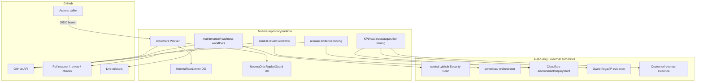
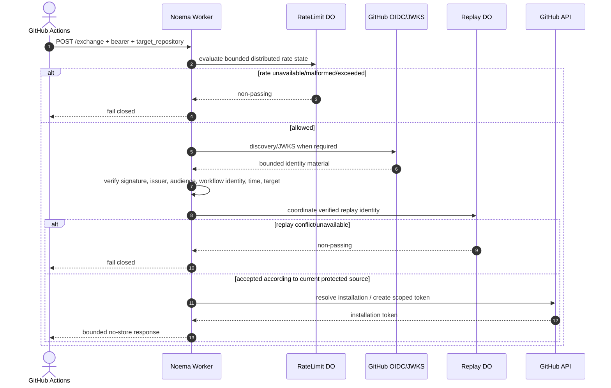
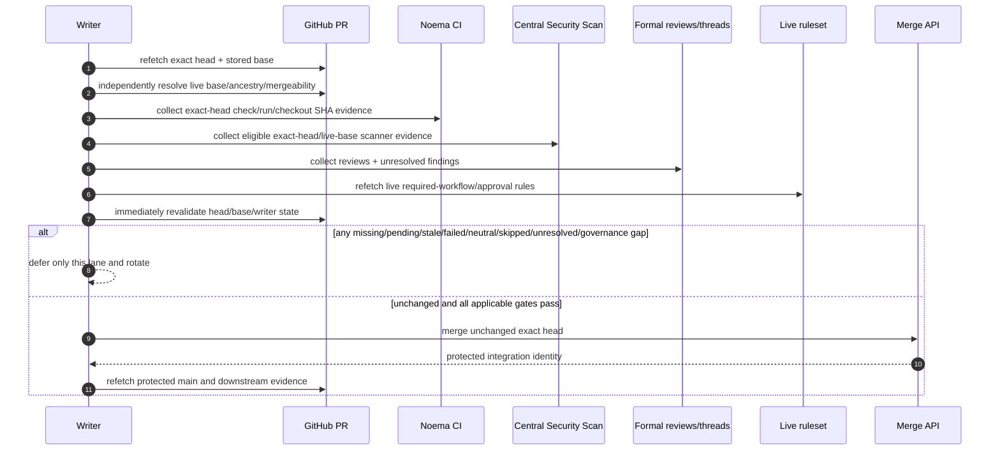
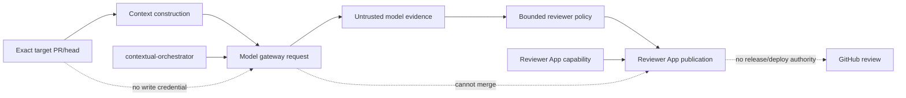
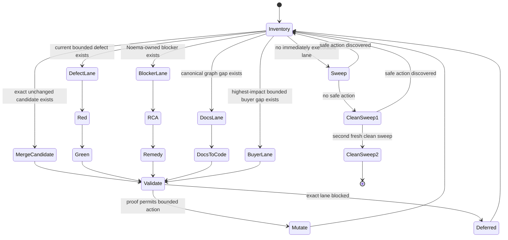
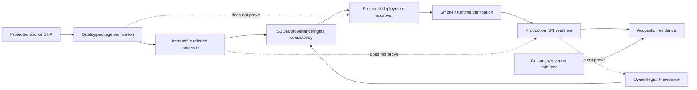
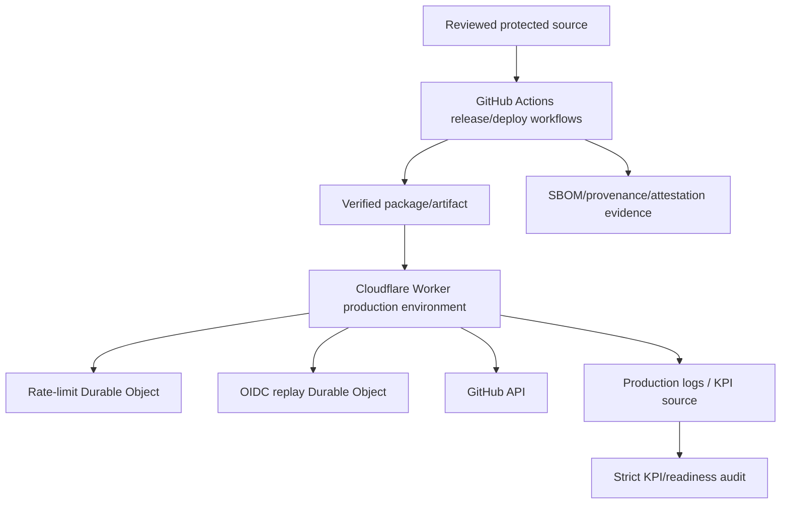

# Noema UML Views

## Status

**Proposed canonical UML rebuilt on protected `main` `382c78f2e9eeac4f24b3a825f192b34943e30c9a`.** Diagrams describe current protected truth unless a node is explicitly marked Proposed/External. They do not elevate stale PR behavior to implementation authority.

## Component view

The central `.github`, `contextual-orchestrator` and external evidence providers are dependencies. Noema's writer must not mutate them merely to satisfy Noema acceptance.

## Credential-exchange sequence

Issue #81 / stale Draft #83 proposes a stricter invariant in which the verified replay claim is guaranteed to complete before token creation. Until rebuilt and integrated after canonical shared-source convergence, that stricter ordering remains Proposed, not protected-main truth.

## Evidence and merge decision sequence

No check/status/model output substitutes for formal approval if live policy requires approval. Conversely, approval is not invented as a requirement when the live ruleset does not require it.

## Review publication trust-domain view

The model/provider plane cannot receive a maintainer publication token or turn its output directly into merge authority.

## Work-conserving repository state machine

Prompt edits, inventory, documentation, one RED/GREEN test, one commit, one PR update or one blocker are intermediate states when another safe action exists.

## Release/deployment authority view

Each stage has independent authority. Current scheduled readiness/acquisition audits may successfully execute while retaining a `NOT_READY` verdict because production/commercial evidence is absent.

## Deployment view

Live environment-review controls, Cloudflare deployment receipts and real production log provenance are external evidence. Documentation or CI cannot fabricate them.

## Data/state view

See `docs/ERD.md`. Runtime persistence is Durable Object state only; GitHub/release/deployment/KPI/legal/acquisition records are external or retained evidence concepts rather than one Noema-owned relational database.

## Current/proposed boundary

Current protected facts include package/install-script/lockfile controls through #91, deployment evidence byte/path integrity through #121, KPI exact-byte/provenance integrity through #250, and maintainer live-governance binding through #254.

The following remain Proposed or incomplete: active Drafts #252/#253, issue #255 action-runtime migration, issue #155 release attestation/lifecycle isolation, stale #83 replay ordering, stale #69 acquisition-manifest integrity, issue #84 broad coverage-exclusion truthfulness, and external production/legal/commercial evidence gaps.
