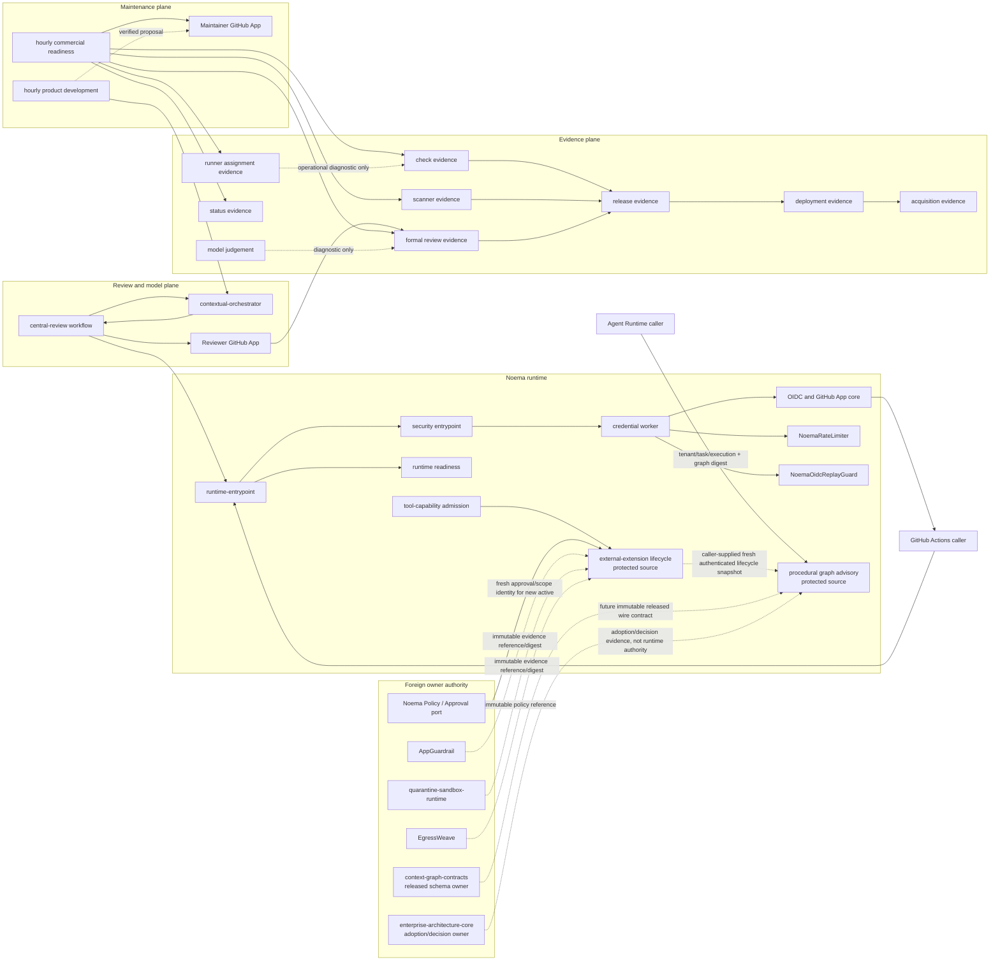
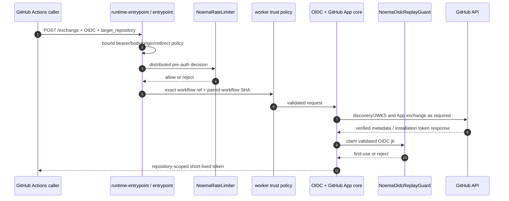
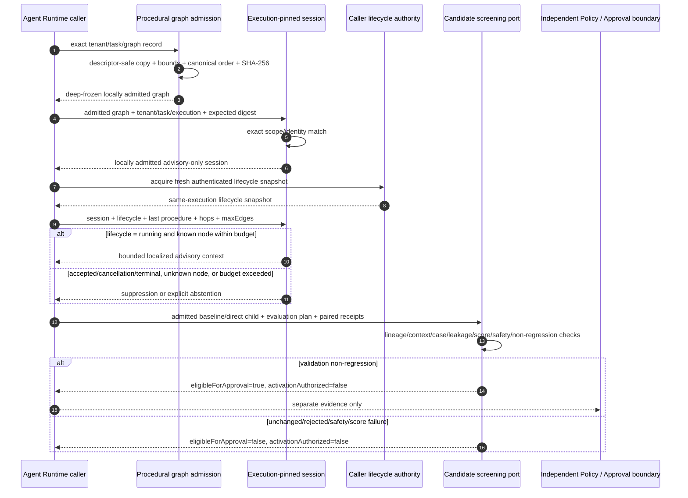
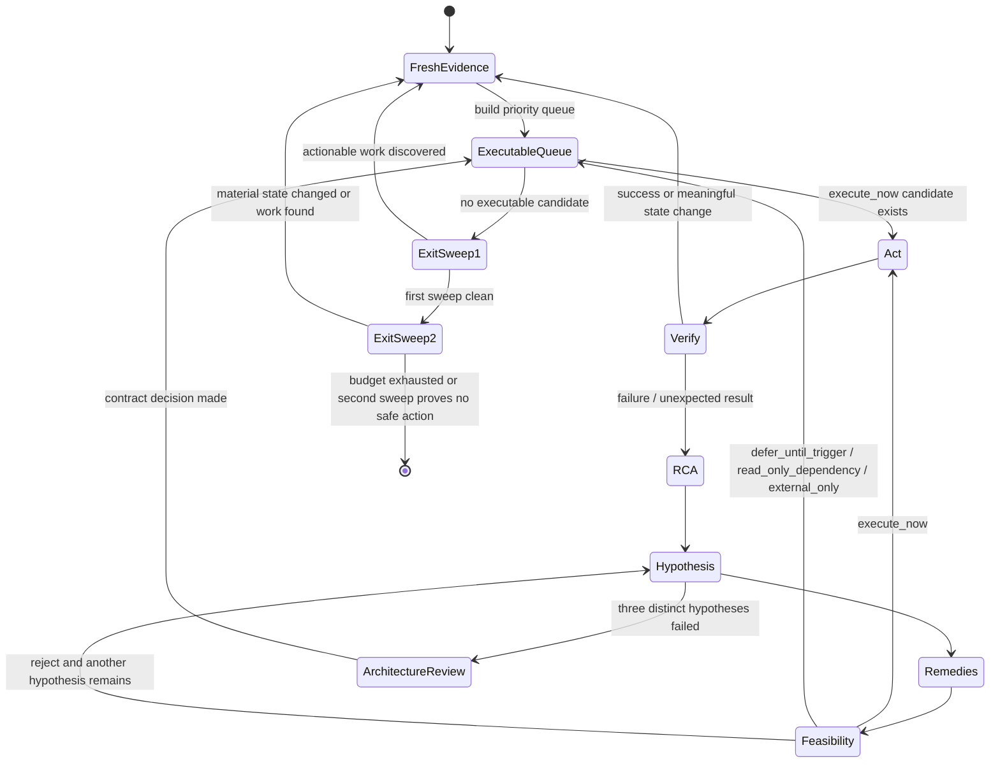
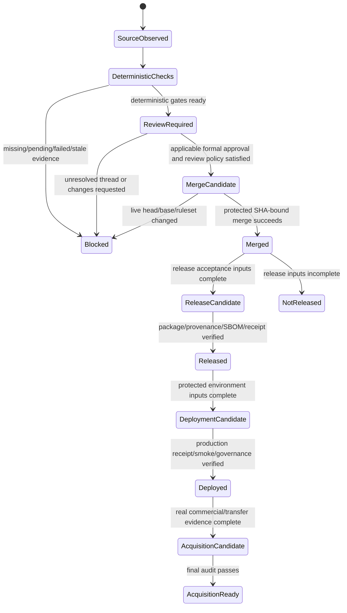

# Noema UML and Control-Flow Views

이 문서는 `ARCHITECTURE.md`를 그림으로 보완합니다. Mermaid diagram은 **현재 구현**, **active proposed control**, **external authority**를 구분해서 읽어야 합니다. active PR에서 구현된 동작은 protected-main에 병합되기 전 배포된 것으로 간주하지 않습니다.

## 1. Bounded-context / component view



`model judgement`에서 formal review/merge authority로 직접 가는 화살표가 없는 것이 의도입니다. `runner assignment evidence` 역시 job을 실행할 수 있는 runner가 배정됐는지를 나타내는 operational evidence일 뿐 check success로 직접 승격되지 않습니다. 외부 Tool Capability evidence 화살표도 reference/digest 전달만 뜻하며 AppGuardrail, quarantine runtime, Egress authority가 Noema로 이전된다는 뜻이 아닙니다. Procedural graph의 외부 화살표도 released schema/adoption evidence 경계만 나타내며 graph content, model routing, credentials 또는 activation authority를 Noema로 이전하지 않습니다. Lifecycle에서 procedural graph로 향하는 점선은 #586 adapter가 caller-supplied snapshot을 소비한다는 뜻일 뿐 Noema가 별도의 durable revocation authority를 graph aggregate 안에 복제한다는 뜻이 아닙니다.

## 2. Credential exchange sequence



어느 단계든 identity/config/network/state가 불완전하면 후속 단계로 진행하지 않습니다.

### 2.1 External-extension lifecycle append

```mermaid
sequenceDiagram
  autonumber
  participant Caller as Noema Tool Capability caller
  participant Repo as Durable lifecycle repository
  participant Head as Compact head + audit tail
  participant Approval as Noema Policy / Approval verifier
  participant Store as Durable Object storage transaction

  Caller->>Repo: append exact stream + transition request
  Repo->>Repo: canonicalize + validate legal edge + hash request
  Repo->>Repo: verify exact duplicate replay index if present
  Repo->>Head: readCurrent exact head + tail
  Head-->>Repo: verified state/version/head or fail closed
  alt genuinely new next_state = active
    Repo->>Approval: re-read current approval/scope + owner evidence
    Approval-->>Repo: verified or reject
  end
  Repo->>Store: transaction expected version/state/head CAS
  alt exact duplicate committed concurrently
    Store-->>Repo: replay candidate only
    Repo->>Repo: verify immutable request/event/head/tail after transaction
    Repo-->>Caller: replay
  else CAS winner
    Store->>Store: append event + transition index + head
    Store-->>Repo: accepted snapshot
    Repo-->>Caller: accepted
  else stale/conflicting writer
    Store-->>Repo: conflict
    Repo-->>Caller: fail closed; no auto-rebase
  end
```

Digest 계산과 Web Crypto replay 검증을 짧은 storage transaction 밖에서 수행하는 것이 의도입니다. 새 `active`만 현재 owner evidence를 다시 읽고, 이미 commit된 exact replay는 이후 mutable authority 변화 때문에 역사에서 제거되지 않습니다.

### 2.2 Protected procedural graph session, screening, and lifecycle projection



Protected procedural graph/session admission and candidate screening remain process-local, and #586 adds only a pure projection over caller-supplied current lifecycle evidence. Evaluation receipt authenticity, durable lifecycle freshness/revocation, graph persistence, approval CAS, canary/rollback, tool invocation and production activation remain outside this sequence as separate authorities.

## 3. PR maintenance sequence

```mermaid
sequenceDiagram
  autonumber
  participant Loop as Commercial readiness loop
  participant GitHub as GitHub APIs
  participant Review as Central Noema review
  participant App as Reviewer App
  participant Maint as Maintainer App

  Loop->>GitHub: paginate open PRs
  loop each current PR
    Loop->>GitHub: fresh head/base/checks/statuses/reviews/threads
    GitHub-->>Loop: revision-bound evidence
    alt valid source defect or failing gate
      Loop-->>Loop: blocked/defer for repair owner
    else Noema review missing and deterministic gates permit review
      Loop->>GitHub: verify no same-head review run
      Loop->>Review: dispatch exact repo/PR/head
      Review->>App: publish formal review after independent analysis
    else merge candidate
      Loop->>GitHub: re-read current PR and evidence
      Loop->>Maint: request SHA-bound squash merge
      Maint->>GitHub: merge expected head only
    end
  end
  Loop->>GitHub: fresh remaining queue count
```

A queued check or review does not become success. A pending item can be deferred while another item is processed.

## 4. Work-conserving autonomous state machine



**No early stop** means `queued`, `pending`, `rate_limited`, `missing_approval`, `active_writer` 같은 상태가 한 work item의 defer reason이지 전체 state machine의 terminal state가 아니라는 뜻입니다.

## 5. Evidence and authority state machine



각 state 전이는 별도 evidence plane을 요구합니다. `Merged`는 `Released`나 `Deployed`의 동의어가 아닙니다.
