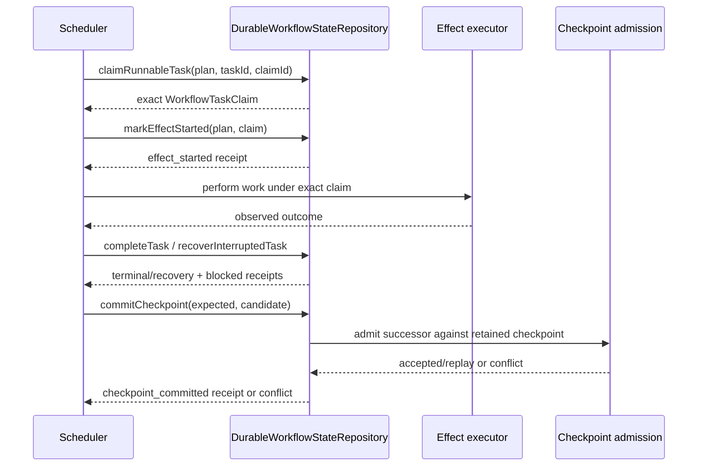

# ADR-0013: Durable workflow execution authority and bounded transition provenance

- **Status:** Proposed
- **Scope:** Agent Runtime / Workflow & Task Execution / State & Checkpoint / Recovery
- **Supersedes:** none
- **Related:** ADR-0012, issue #541, active stacked PR #542

## Context

Noema's pure Workflow / Task selector can determine which admitted tasks are runnable, but a selector result is only a candidate. It cannot reserve a task, prove that an effect started, serialize cancellation against a claim, or make a checkpoint successor durable across process restarts. Treating an in-memory selector or process-local lock as execution authority would permit duplicate effects and divergent checkpoint histories after restart or concurrent scheduling.

Noema owns this runtime execution authority. It does not own LLM provider routing, quarantine/security verdicts, outbound policy, or foreign product state, so the durable record must stay limited to Noema execution identities and transitions.

## Constraints

- A task may start work only after an atomic durable claim for the exact admitted `executionId`, `planId`, `taskId`, attempt and claim identity.
- Checkpoint history uses compare-and-swap against the exact retained sequence and digest.
- A transport failure must not imply that a side effect is safe to retry.
- Failed or cancelled prerequisites must not leave descendants indefinitely pending.
- Cancellation must prevent new claims without erasing an already-running claim whose external outcome may still need reconciliation or compensation.
- Scheduling order must be explicit and versioned rather than an accidental array-order behavior.
- Runtime evidence must distinguish claim, effect start, completion, cancellation, recovery, blocked descendants and checkpoint commits without storing prompts, tool payloads, provider credentials, foreign domain data or security verdicts.
- Provenance retained in the execution record must be bounded; durable execution state is not an unbounded audit warehouse.

## Considered options

### Process-local reservation and checkpoint CAS

Rejected. It is inexpensive but loses authority on restart and cannot prevent two processes from acting on the same candidate.

### Introduce PostgreSQL for workflow execution state

Deferred. PostgreSQL can provide transactional claims and compare-and-swap, but selecting a new database solely for this boundary would expand Noema's deployment and recovery surface before there is evidence that the current Worker runtime cannot provide the required transaction semantics.

### Reuse another CWL product's persistence or workflow state

Rejected. It would create cross-service authority coupling or cross-service SQL and would move Noema's runtime truth into a foreign bounded context.

### Cloudflare Durable Object storage behind a Noema repository boundary

Selected for the current implementation candidate. It is already part of Noema's runtime technology, provides a transaction boundary, and can remain hidden behind the Noema-owned `DurableWorkflowStateRepository`. This decision is about the port and invariants, not permanent vendor lock-in; a future adapter may replace the storage technology while preserving the same domain/application contract.

## Decision

Noema will separate five authorities:

1. **Runnable candidate** — pure selector output; no execution authority.
2. **Durable claim** — one transaction changes a still-runnable pending task to running and returns the exact claim identity.
3. **Effect start** — the active claim explicitly records that execution crossed the effect boundary. This evidence is idempotent for the same claim and grants no retry authority.
4. **Terminal/recovery transition** — completion, cancellation, blocked-descendant classification or explicit interrupted-attempt recovery is recorded under the current claim/policy.
5. **Checkpoint commit** — an admitted successor wins only if the retained checkpoint still equals caller evidence.

The current scheduling policy is `workflow-execution-policy.v1` with deterministic `admission_order`. Pure/idempotent interrupted work has a bounded automatic recovery ceiling; once exhausted it fails so independent later work cannot be starved forever. A side-effecting claim whose durable `effectStarted` evidence is still `false` may be released under the same bounded recovery ceiling because Noema can prove the external effect boundary was not crossed. Once `effectStarted` is `true`, the side effect is never silently replayed and instead requires an explicit observed outcome or compensation decision.

Cancellation is not evidence that already-started work did not complete externally. A started or legacy-unknown `idempotent` claim therefore remains running after cancellation until an explicit observed outcome or reconciliation resolves it. Idempotency permits a deliberate safe replay while the execution policy still authorizes retry; it does not authorize Noema to erase the active claim and manufacture a terminal `cancelled` outcome. An idempotent claim that is durably proven unstarted (`effectStarted=false`) may still be cancelled without reconciliation.

The state record retains a monotonic transition sequence and at most `MAX_TRANSITION_RECEIPTS` payload-minimized receipts. Truncation is observable because the total sequence continues after old receipts are dropped. The retained receipt contains only transition type, task/claim/attempt/cancellation identities, resulting task state and checkpoint sequence/digest.

Legacy state records that predate the transition ledger remain readable only when the ledger is entirely absent. A partially present or malformed ledger fails closed. Missing historical effect-start evidence is exposed as unknown (`null`) rather than fabricated as false, so legacy side-effecting attempts without affirmative pre-effect evidence cannot be treated as safely replayable.

## State and authority sequence

## Consequences

- Concurrent scheduler processes cannot both acquire the same pending task when the storage transaction contract is honored.
- Restarted processes can reconstruct the active claim instead of minting a replacement claim for a possibly-started side effect.
- A failed effect-start persistence write is distinguishable from an uncertain effect outcome: if durable state still proves `effectStarted=false`, recovery may release the claim; if the marker is true or legacy evidence is unknown, side-effecting replay remains fail-closed.
- Cancellation of already-started idempotent work preserves the active claim until outcome/reconciliation evidence exists, preventing cancellation from becoming fabricated external-outcome authority.
- Operators can tell whether durable authority stopped at candidate selection, claim, effect start, terminal outcome, cancellation/recovery, or checkpoint commit.
- Evidence size is bounded, so this ledger is suitable for operational provenance but not a substitute for a separately governed long-term audit/event store.
- Adding an effect-start marker creates a caller obligation: production composition must persist it immediately before crossing the actual effect boundary. Merely exposing the method is not production acceptance.

## Risks and rejected shortcuts

- A caller that claims a task but cannot persist effect start must not invoke the external effect. The application runner therefore stops before effect invocation on marker failure; recovery may release only the exact claim for which retained durable state still proves the effect never started.
- A caller that crosses the external effect boundary without first persisting `effectStarted=true` violates the authority protocol and can make restart recovery unsafe; this ordering must remain an executable application-boundary invariant.
- Treating `idempotent` as equivalent to `pure` during cancellation is unsafe: the effect may have changed external state even though a repeated invocation would converge to the same result. Cancellation must not invent that first invocation's outcome.
- Durable Object transaction behavior must be verified in the deployed/runtime-compatible environment; an in-memory test double alone is insufficient commercial evidence.
- The transition ledger must not accumulate foreign payloads in future extensions. New receipt fields require a privacy/authority review.
- `queued` GitHub checks, predecessor-head results, or this ADR's existence do not make the implementation protected truth.

## Verification and acceptance

The current candidate is exercised by state-store tests for concurrent claims, checkpoint races, cancellation, bounded retry, blocked descendants, restart claim reconstruction and transition provenance. The cancellation regressions additionally require a started idempotent task to retain its exact running claim after cancellation until explicit reconciliation/outcome evidence exists, while preserving the existing safe cancellation path for work proven not to have crossed its effect boundary. The provenance regression requires distinct `task_claimed` and `effect_started` receipts and verifies bounded receipt retention. The application-runner regressions verify that durable claim and effect-start authority precede effect invocation, that effect-start persistence failure invokes no external effect, that a side-effecting claim proven unstarted can be recovered and re-claimed, and that an effect-started uncertain side effect remains running for explicit reconciliation rather than implicit retry.

Before this ADR can become `Accepted`:

- the exact implementation head must pass repository typecheck/tests, owned production statement/branch coverage, review, security and applicable image/SBOM/provenance gates;
- production composition must use durable claim → effect-start evidence → effect/outcome under the exact claim;
- restart/recovery and real Durable Object transaction behavior must have executable acceptance evidence;
- PRD/TRD/Architecture/UML/TEST_STRATEGY/OPERABILITY/TRACEABILITY/CHANGELOG and the product technical gap baseline must describe the same boundary without presenting the active PR as protected truth;
- the stacked foundation must integrate normally and this work must be non-force restacked/revalidated against the resulting protected base.
