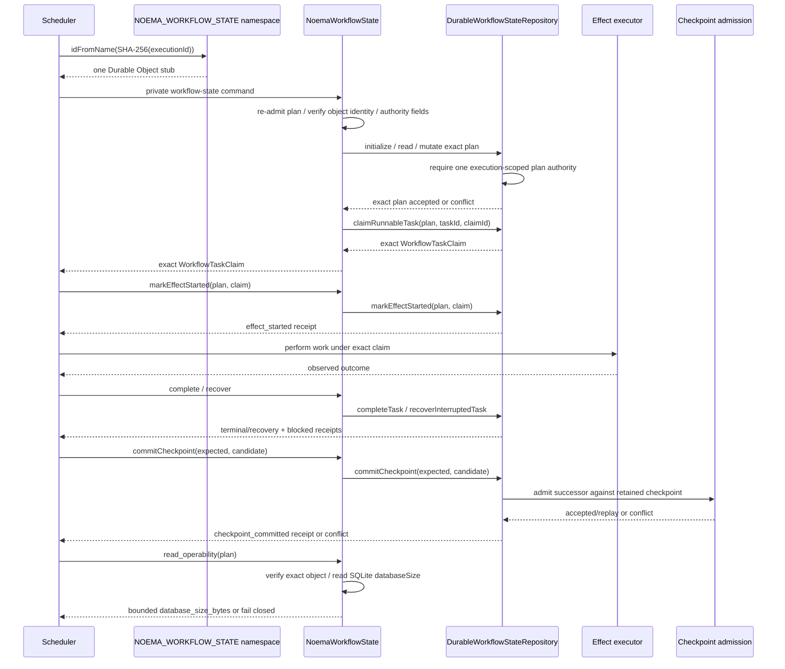

# ADR-0013: Durable workflow execution authority and bounded transition provenance

- **Status:** Proposed
- **Scope:** Agent Runtime / Workflow & Task Execution / State & Checkpoint / Recovery
- **Supersedes:** none
- **Related:** ADR-0012, issue #541, protected source lineage from PR #542, operability extension PR #605

## Context

Noema's pure Workflow / Task selector can determine which admitted tasks are runnable, but a selector result is only a candidate. It cannot reserve a task, prove that an effect started, serialize cancellation against a claim, or make a checkpoint successor durable across process restarts. Treating an in-memory selector or process-local lock as execution authority would permit duplicate effects and divergent checkpoint histories after restart or concurrent scheduling.

Noema owns this runtime execution authority. It does not own LLM provider routing, quarantine/security verdicts, outbound policy, or foreign product state, so the durable record must stay limited to Noema execution identities and transitions.

## Constraints

- A task may start work only after an atomic durable claim for the exact admitted `executionId`, `planId`, `taskId`, attempt and claim identity.
- Checkpoint history uses compare-and-swap against the exact retained sequence and digest.
- A transport failure must not imply that a side effect is safe to retry.
- Failed or cancelled prerequisites must not leave descendants indefinitely pending.
- Cancellation must prevent new claims without erasing an already-running claim whose external outcome may still need reconciliation or compensation.
- Scheduling order must be explicit and versioned rather than an accidental array-order behavior.
- Runtime evidence must distinguish claim, effect start, completion, cancellation, recovery, blocked descendants and checkpoint commits without storing prompts, tool payloads, provider credentials, foreign domain data or security verdicts.
- Provenance retained in the execution record must be bounded; durable execution state is not an unbounded audit warehouse.
- One execution must resolve to one production serialization authority and one admitted plan identity before any repository mutation is attempted. Tests that serialize only an in-memory fake are insufficient deployment evidence.
- Operability observation must remain bound to that same execution-scoped object. Its success result may expose only bounded platform metadata required to produce later operational evidence and must not return workflow/task payloads, raw execution identity, foreign-owner truth or secrets.

## Considered options

### Process-local reservation and checkpoint CAS

Rejected. It is inexpensive but loses authority on restart and cannot prevent two processes from acting on the same candidate.

### Introduce PostgreSQL for workflow execution state

Deferred. PostgreSQL can provide transactional claims and compare-and-swap, but selecting a new database solely for this boundary would expand Noema's deployment and recovery surface before there is evidence that the current Worker runtime cannot provide the required transaction semantics.

### Reuse another CWL product's persistence or workflow state

Rejected. It would create cross-service authority coupling or cross-service SQL and would move Noema's runtime truth into a foreign bounded context.

### Cloudflare Durable Object storage behind a Noema repository boundary

Selected for the protected Workflow / Task execution authority. It is already part of Noema's runtime technology, provides a transaction boundary, and remains hidden behind the Noema-owned `DurableWorkflowStateRepository`. This decision is about the port and invariants, not permanent vendor lock-in; a future adapter may replace the storage technology while preserving the same domain/application contract.

The protected implementation maps `workflowStateObjectName` from a validated canonical execution identity to a SHA-256-derived `workflow:<digest>` Durable Object name. `routeWorkflowStateCommand` therefore sends every plan revision and scheduler caller for the same execution to the same `NOEMA_WORKFLOW_STATE` object. `NoemaWorkflowState` independently re-admits the plan, re-derives the expected object name, verifies it against the object's retained `DurableObjectState.id.name`, and admits authority-bearing checkpoint/claim data before delegating storage mutations to `DurableWorkflowStateRepository`. A command delivered through another execution's object identity, or through an unnamed object identity, fails closed before storage mutation. `src/runtime-entrypoint.ts` exports the class and `wrangler.toml` declares the `NOEMA_WORKFLOW_STATE` binding plus SQLite-backed `NoemaWorkflowState` export. Raw execution identity is not embedded in the Durable Object name.

Inside that execution-scoped object, the repository retains an execution-scoped `workflow-state-plan-authority:v1:<executionId>` record in the same initialization transaction as the plan-specific workflow state. The authority record binds the execution to exactly one `planId`; initialization of a second plan identity is rejected before another state record can become active. Every read and mutation requires this authority and still independently validates the retained workflow record against the complete admitted plan revision, including task dependencies. The existing plan-specific state key is retained as a storage-layout detail rather than as permission to run multiple plans for one execution.

The private adapter uses an internal JSON `fetch` command boundary instead of making the Durable Object protocol part of Noema's public API. Cloudflare documents that Durable Objects are reached through a configured binding, so the `NOEMA_WORKFLOW_STATE` namespace binding is the current caller-capability boundary rather than a public HTTP endpoint. Noema does not add a second shared-secret protocol inside that binding unless a future service/tenant trust boundary makes it necessary. Cloudflare's invocation guidance recommends RPC for newer compatibility dates; that remains an adapter refinement, not authority to bypass the repository contract. Any future RPC migration must preserve command validation, one-execution routing, failure mapping, tests and rollback semantics.

The same private adapter also exposes `read_operability` as an observation-only operation. It reuses the admitted plan and exact hashed Durable Object identity, then returns only `{ database_size_bytes }` from `DurableObjectStorage.sql.databaseSize`. Caller-only properties outside the canonical command schema are projected out before serialization; the admitted plan intentionally crosses the private boundary so the object can re-admit and verify execution/plan authority. A command routed to a different execution object conflicts before reading storage metadata; an unreadable, negative, non-integer or otherwise non-canonical byte count is normalized to the existing storage-unavailable failure contract. This operation does not read retained workflow state or return workflow/task payloads or raw execution identity in its result, and it grants no mutation, retry, recovery, deployment or release authority. The value is a source-level evidence producer only; an in-memory/fake byte count is not production storage-growth evidence.

## Decision

Noema will separate five authorities:

1. **Runnable candidate** — pure selector output; no execution authority.
2. **Durable claim** — one transaction changes a still-runnable pending task to running and returns the exact claim identity.
3. **Effect start** — the active claim explicitly records that execution crossed the effect boundary. This evidence is idempotent for the same claim and grants no retry authority.
4. **Terminal/recovery transition** — completion, cancellation, blocked-descendant classification or explicit interrupted-attempt recovery is recorded under the current claim/policy.
5. **Checkpoint commit** — an admitted successor wins only if the retained checkpoint still equals caller evidence.

Production routing adds two infrastructure invariants before those five authorities: all mutations for a canonical `executionId` are addressed to the same hashed Durable Object identity, and that object retains one execution-scoped admitted-plan authority. The Durable Object is a serialization boundary, not a new domain aggregate or foreign source of truth. `planId` binds the exact admitted graph revision inside that object, and a different `planId` for the same execution is rejected rather than creating a parallel workflow authority.

The current scheduling policy is `workflow-execution-policy.v1` with deterministic `admission_order`. Pure/idempotent interrupted work has a bounded automatic recovery ceiling; once exhausted it fails so independent later work cannot be starved forever. A side-effecting claim whose durable `effectStarted` evidence is still `false` may be released under the same bounded recovery ceiling because Noema can prove the external effect boundary was not crossed. Once `effectStarted` is `true`, the side effect is never silently replayed and instead requires an explicit observed outcome or compensation decision.

Cancellation is not evidence that already-started work did not complete externally. A started or legacy-unknown `idempotent` claim therefore remains running after cancellation until an explicit observed outcome or reconciliation resolves it. Idempotency permits a deliberate safe replay while the execution policy still authorizes retry; it does not authorize Noema to erase the active claim and manufacture a terminal `cancelled` outcome. An idempotent claim that is durably proven unstarted (`effectStarted=false`) may still be cancelled without reconciliation.

The state record retains a monotonic transition sequence and at most `MAX_TRANSITION_RECEIPTS` payload-minimized receipts. Truncation is observable because the total sequence continues after old receipts are dropped. The retained receipt contains only transition type, task/claim/attempt/cancellation identities, resulting task state and checkpoint sequence/digest.

Legacy state records that predate the transition ledger remain readable only when the ledger is entirely absent. A partially present or malformed ledger fails closed. Missing historical effect-start evidence is exposed as unknown (`null`) rather than fabricated as false, so legacy side-effecting attempts without affirmative pre-effect evidence cannot be treated as safely replayable.

Retained bytes are not trusted merely because the Durable Object storage operation succeeded. A malformed root record, task vector/task record, checkpoint object, transition receipt, execution-plan authority, or other impossible retained state is classified as a `WorkflowStateConflictError`, not as `WorkflowStateStoreUnavailableError`. The latter is reserved for an unavailable storage operation or platform storage metadata required by an observation-only operation. This distinction prevents durable data corruption from being presented to callers as a transient 503 that invites blind retry.

The workflow-state Durable Object binding and execution-plan authority are already present in protected source, but Noema still has no released production workflow-state dataset whose successful deployment can be inferred from source alone. Candidate records created before the execution-plan authority existed are not silently trusted. Only exact-plan `initialize` may backfill a missing authority when the retained plan-specific record independently validates against the same admitted plan and checkpoint; ordinary reads/mutations fail closed while authority is absent. A different-plan candidate record is never promoted by that compatibility path. The first accepted deployment must not reuse ungoverned pre-merge candidate namespace data as production authority.

## State and authority sequence

## Consequences

- Concurrent scheduler processes cannot both acquire the same pending task when they address the same execution Durable Object and the storage transaction contract is honored.
- Two plan identities cannot become parallel execution authorities inside one execution Durable Object; the first retained execution-plan authority wins until a separately designed migration/revision protocol exists.
- Restarted processes can reconstruct the active claim instead of minting a replacement claim for a possibly-started side effect.
- A failed effect-start persistence write is distinguishable from an uncertain effect outcome: if durable state still proves `effectStarted=false`, recovery may release the claim; if the marker is true or legacy evidence is unknown, side-effecting replay remains fail-closed.
- Cancellation of already-started idempotent work preserves the active claim until outcome/reconciliation evidence exists, preventing cancellation from becoming fabricated external-outcome authority.
- Operators can tell whether durable authority stopped at candidate selection, claim, effect start, terminal outcome, cancellation/recovery, or checkpoint commit.
- Structurally corrupt retained state fails as a state conflict instead of masquerading as a transient storage outage.
- Evidence size is bounded, so this ledger is suitable for operational provenance but not a substitute for a separately governed long-term audit/event store.
- Adding an effect-start marker creates a caller obligation: production composition must persist it immediately before crossing the actual effect boundary. Merely exposing the method is not production acceptance.
- Durable Object routing is explicit deployment configuration rather than an implicit assumption in an in-memory test harness.
- The observation-only storage-size command lets a deployed evidence producer bind later storage-growth measurements to the exact execution-scoped object without exposing retained workflow state. Source/fake values alone still prove neither deployment nor a growth denominator.

## Risks and rejected shortcuts

- A caller that claims a task but cannot persist effect start must not invoke the external effect. The application runner therefore stops before effect invocation on marker failure; recovery may release only the exact claim for which retained durable state still proves the effect never started.
- A caller that crosses the external effect boundary without first persisting `effectStarted=true` violates the authority protocol and can make restart recovery unsafe; this ordering must remain an executable application-boundary invariant.
- Treating `idempotent` as equivalent to `pure` during cancellation is unsafe: the effect may have changed external state even though a repeated invocation would converge to the same result. Cancellation must not invent that first invocation's outcome.
- Durable Object transaction behavior must be verified in the deployed/runtime-compatible environment; a serialized in-memory backing store proves adapter composition but does not substitute for Cloudflare/workerd transaction and restart evidence.
- A `database_size_bytes` value from a fake or isolated unit test must not be promoted to deployed storage-growth, capacity or SLO evidence. Operational evidence needs exact release/deployment/object identity, observation window and workload/retention denominator.
- An execution-plan revision is not implemented by creating another plan-specific record under the same execution. A future migration protocol must explicitly quiesce the prior plan, preserve recovery/checkpoint invariants, and atomically replace the execution-scoped plan authority.
- A future RPC migration must not create a second authority path beside the private fetch adapter. One migration replaces the adapter only after parity tests and rollback evidence are present.
- The transition ledger must not accumulate foreign payloads in future extensions. New receipt fields require a privacy/authority review.
- `queued` GitHub checks, predecessor-head results, or this ADR's existence do not make an implementation or operational claim protected truth.

## Verification and acceptance

Protected source is exercised by state-store tests for concurrent claims, checkpoint races, cancellation, bounded retry, blocked descendants, restart claim reconstruction and transition provenance. The cancellation regressions additionally require a started idempotent task to retain its exact running claim after cancellation until explicit reconciliation/outcome evidence exists, while preserving the existing safe cancellation path for work proven not to have crossed its effect boundary. The provenance regression requires distinct `task_claimed` and `effect_started` receipts and verifies bounded receipt retention. The application-runner regressions verify that durable claim and effect-start authority precede effect invocation, that effect-start persistence failure invokes no external effect, that a side-effecting claim proven unstarted can be recovered and re-claimed, and that an effect-started uncertain side effect remains running for explicit reconciliation rather than implicit retry.

`test/workflow-state-durable-object-routing.test.ts` exercises the production adapter class and namespace routing contract: two concurrent routed side-effect claims for one execution must reach one object and produce one 200 winner plus one 409 conflict; distinct executions derive distinct hashed object names; commands delivered to a foreign or unnamed object identity must fail before durable mutation; all repository command families cross the private adapter; malformed plans/checkpoints/claims and unavailable storage fail closed. `test/workflow-state-durable-object-plan-authority.test.ts` additionally routes two plan identities for one execution through the same object and requires the second initialization and claim to conflict while the first plan remains readable. `test/workflow-state-store-plan-authority.test.ts` verifies malformed authority is a durable-state conflict rather than a retryable storage outage and that missing authority can be backfilled only by exact retained-plan reinitialization. `test/workflow-state-store-malformed-record-shape.test.ts` corrupts the retained root record, task vector, task entry, checkpoint, and transition receipt and requires each case to remain a state conflict rather than being normalized into storage-unavailable retry evidence.

`test/workflow-state-operability-evidence.test.ts` exercises only the bounded operability extension: deterministic routing reaches the same hashed execution-scoped object; caller-only fields outside the command schema are projected out while the canonical admitted plan intentionally crosses the private boundary for re-admission; another execution object's identity is rejected; the returned success payload contains only `database_size_bytes`; and invalid or throwing SQLite metadata fails as storage unavailable. These tests establish source semantics only. They do not substitute for a deployed object, representative transactions, restart/recovery, contention, storage-growth, latency or release evidence.

Before this ADR can become `Accepted`:

- the exact protected implementation must pass repository typecheck/tests, owned production statement/branch coverage, review, security and applicable image/SBOM/provenance gates;
- production composition must use the declared `NOEMA_WORKFLOW_STATE` binding, the execution-scoped plan authority, and durable claim → effect-start evidence → effect/outcome under the exact claim;
- restart/recovery and real Durable Object transaction behavior must have executable runtime-compatible acceptance evidence;
- deployed storage-growth evidence must be sampled from the exact execution-scoped object under an identified workload/window using the bounded observation contract rather than namespace aggregates or synthetic/fake values;
- PRD/TRD/Architecture/UML/TEST_STRATEGY/OPERABILITY/TRACEABILITY/CHANGELOG and the product technical gap baseline must describe the same boundary without converting source capability into deployed/released evidence;
- immutable version/tag/package/SBOM/provenance/reproducibility and rollback evidence must bind the accepted deployment to the exact protected source.

## References

Cloudflare. (2026). *Invoke methods*. Cloudflare Durable Objects documentation. https://developers.cloudflare.com/durable-objects/best-practices/create-durable-object-stubs-and-send-requests/

Cloudflare. (2026). *Getting started*. Cloudflare Durable Objects documentation. https://developers.cloudflare.com/durable-objects/get-started/

Cloudflare. (2026). *Durable Object Namespace*. Cloudflare Durable Objects documentation. https://developers.cloudflare.com/durable-objects/api/namespace/

Cloudflare. (2026). *SQLite-backed Durable Object Storage*. Cloudflare Durable Objects documentation. https://developers.cloudflare.com/durable-objects/api/sqlite-storage-api/
