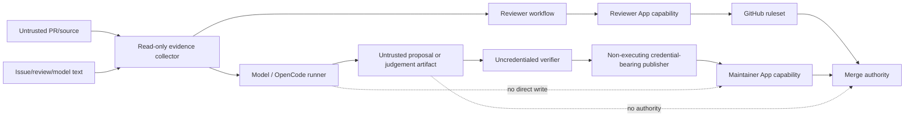

# Noema Autonomous Maintenance Threat Model

## Status

Proposed companion threat model for Noema review, commercial-readiness and product-development automation. Runtime credential-exchange threats remain in `docs/threat-model.md`. This document does not change GitHub permissions or activate automation by itself.

## 1. Assets

- protected repository source and branch history;
- PR exact-head/base ancestry;
- Maintainer GitHub App credential/capability;
- Reviewer GitHub App identity and formal-review authority;
- `NVIDIA_NIM_API_KEY` and model request budget;
- central workflow source identity;
- verified proposal patch/artifact and metadata;
- check/status/review/scanner/model evidence;
- ruleset/governance configuration;
- release/SBOM/provenance/deployment evidence;
- production/customer/revenue/transfer evidence.

## 2. Trust domains

The security objective is to prevent a lower-trust domain from converting its output into a stronger authority without an independent deterministic boundary.

## 3. Threat actors

- malicious contributor controlling PR source or metadata;
- compromised dependency or GitHub Action;
- prompt-injected issue/comment/source content influencing an LLM;
- compromised model/provider response;
- compromised Reviewer or Maintainer App key;
- accidental maintainer misconfiguration;
- stale concurrent automation writer;
- third-party integration spoofing familiar check/status names;
- internal operator acting through an undocumented break-glass path.

## 4. Primary threats and controls

### T-A01 Model-to-write credential crossing

**Threat:** untrusted source/model output executes in a runner that also holds repository write credential, allowing prompt/code injection to mutate the repository.

**Controls:**

- proposal/model runner receives no Maintainer App token;
- verifier receives no model or publisher credential;
- publisher reconstructs verified artifact without executing proposed code;
- Maintainer App is minted late and scoped to one repository;
- arbitrary model-created shell commands do not become publisher commands.

**Residual risk:** model provider receives repository context allowed by the proposal workflow; confidentiality/data-retention requirements need separate provider governance.

### T-A02 Repair-workflow privilege escalation

**Threat:** agent creates temporary `.github/workflows/repair-*`, self-modifying Action or branch-patching `contents:write` workflow to bypass an unavailable normal write path.

**Controls:**

- ADR-0004 prohibits this mechanism;
- safe connector/trusted-checkout paths are empirically evaluated before escalation;
- workflow contract/repository search rejects prohibited automation;
- stale blob/ref identity must fail rather than trigger force overwrite.

### T-A03 Stale-head overwrite

**Threat:** another writer changes the PR branch after analysis but before mutation; automation overwrites or validates the old source.

**Controls:**

- fresh `head.sha` immediately before every source-affecting write;
- current blob/ref identity bound to connector/API mutation;
- branch-local writer freeze after observing another writer;
- no predecessor-head verification reused as current evidence.

### T-A04 Base/stack ancestry confusion

**Threat:** PR head remains unchanged while base/predecessor moves; old integration/security/lockfile evidence is treated as current.

**Controls:**

- independently resolve live base/predecessor tip;
- distinguish event-time base snapshot from live base;
- base-sensitive validation repeats on change;
- stacked PR stays in dependency order instead of early retarget for nominal checks.

### T-A05 Check/status/reviewer spoofing

**Threat:** attacker or unrelated App publishes a success status/check or bot comment with a trusted-looking name and satisfies merge policy.

**Controls:**

- check producer App identity and suite identity retained;
- commit statuses collected independently from check runs;
- formal GitHub reviews collected independently from model/comment evidence;
- reviewer App login/credential marker and current head binding validated;
- live ruleset/approval eligibility remains separate authority.

### T-A06 Incomplete pagination

**Threat:** failure/changes-requested/unresolved evidence after page 1 is omitted.

**Controls:** full pagination for every policy-material collection; malformed/missing page fails closed; regression fixtures exceed default page sizes.

### T-A07 Lost/malformed PR-create response

**Threat:** publisher creates a PR but loses the response, then broad cleanup closes/deletes another actor's resource.

**Controls proposed by PR #80:** unique cryptographic publication marker, exact branch/head/base match, numeric PR identity, unique recovery only, conditional branch cleanup.

### T-A08 Proposal branch race

**Threat:** another actor creates same remote branch between inventory read and push, or advances it before cleanup.

**Controls proposed by PR #80:** expected-absence branch creation lease and exact-created-head deletion lease; no check-then-unguarded-push or unconditional delete.

### T-A09 Queue race after generation

**Threat:** a human/automation opens another PR or base advances while the model is generating; publisher creates a conflicting second proposal.

**Controls:** publication revalidates open PR queue and live base after expensive generation and again before accepting publication. Conflict fails closed.

### T-A10 Prompt injection through repository content

**Threat:** PR/issue/source text instructs model to reveal secrets, change permissions, weaken tests or publish unauthorized code.

**Controls:**

- repository/model content is untrusted observation;
- model runner has no GitHub/OIDC/runtime write credential;
- OpenCode permission denies external-network/git/gh operations where configured;
- proposal undergoes deterministic fresh-runner verification;
- model judgement is never merge authority;
- security/coverage/ruleset requirements remain deterministic.

### T-A11 Secret exfiltration through artifacts/logs

**Threat:** model, test, PR metadata or error logs persist App token, OIDC token, NVIDIA key, private key or sensitive request body.

**Controls:** credential separation, no secret reflection, bounded/redacted logging, owner-only temp files, untrusted PR-message parser, artifact allowlist/budgets, no tokens in retained evidence.

### T-A12 Provider outage converted into weaker governance

**Threat:** CodeRabbit/OpenCode/NVIDIA cooldown or rate limit leads automation to weaken review/security or treat missing model evidence as approval.

**Controls:** model availability is a local defer; deterministic work continues; no fallback to Copilot credential; model/status evidence is not formal approval; required gate absence remains non-passing.

### T-A13 Governance documentation drift

**Threat:** automation follows stale PR body/chat summary instead of current code/policy and makes unsafe authority assumptions.

**Controls:** canonical GitHub PRD/TRD/Architecture/ADR/UML/ERD/Traceability; documentation contract tests; fresh live evidence overrides remembered SHA/run/review state; implemented/planned/external status separation.

### T-A14 Infinite reporting loop / work starvation

**Threat:** one unchanged blocker consumes every hourly run, starving security/product/documentation work.

**Controls:** ADR-0002 work-conserving queue, keyed defer, no routine report as exit, mandatory double exit sweep, three-hypothesis architecture reassessment.

### T-A15 Auto-merge/release authority collapse

**Threat:** successful merge is interpreted as successful release/deployment/acquisition evidence.

**Controls:** ADR-0001 separates merge/release/deploy/commercial authority and `docs/ERD.md` models them as distinct entities; release/deployment scripts require separate receipts and governance.

## 5. STRIDE mapping

| STRIDE | Automation examples | Principal controls |
| --- | --- | --- |
| Spoofing | trusted-looking check/reviewer/status, branch identity confusion | producer identity, exact SHA, formal review eligibility |
| Tampering | stale overwrite, artifact substitution, branch race | blob/ref CAS, artifact digest, conditional push/cleanup |
| Repudiation | undocumented break-glass, model verdict presented as review | separate identities/evidence classes, retained bounded receipts |
| Information disclosure | secret in logs/artifacts/model prompt | credential isolation, redaction/no-reflection, bounded evidence |
| Denial of service | provider cooldown, queue starvation, repeated retries | work-conserving defer, bounded timeout/retry, fallback without authority weakening |
| Elevation of privilege | repair workflow, model runner gets write token, status→approval | trust-domain separation, ADR-0004, deterministic authority gates |

## 6. Security invariants

1. No model output directly grants repository write, merge, release or deployment authority.
2. No source-affecting write occurs without fresh exact target identity.
3. No temporary workflow is created merely to repair its own PR branch.
4. No pending/missing/stale evidence becomes success because waiting is inconvenient.
5. No App permission is broadened solely to manufacture approval or bypass an unavailable path.
6. No full-page evidence decision is made from a partial paginated collection.
7. No cleanup deletes a remote ref/PR the run cannot uniquely prove it owns.
8. No release/deployment/commercial claim is synthesized from lower-plane green evidence.

## 7. Required verification

- current-head workflow/document tests;
- full pagination and evidence-collision tests;
- model-runner credential isolation tests;
- proposal artifact identity and fresh-runner tests;
- stale-writer and publisher-race regressions;
- repository search for prohibited repair workflows;
- exact reviewer/maintainer App operational preflight;
- protected-main ruleset evidence;
- post-merge operational acceptance for new privileged control paths.

## 8. Residual external risks

Repository code cannot alone prove:

- GitHub ruleset is enforceable against normal/admin paths;
- Reviewer/Maintainer App installation and key ownership are correct;
- production environment reviewers/branch policies are enabled;
- external model provider retention/residency terms satisfy a customer contract;
- actual production KPI/customer/revenue/transfer evidence exists.

These remain external evidence and must not be closed with documentation-only changes.

## 9. Rationale and references

Primary-source rationale and APA 7 references for GitHub OIDC, SLSA source identity, NIST SSDF, Cloudflare capability/state semantics are maintained in `docs/doctoring/architecture-trust-boundaries.md`. Git conditional ref-update and publisher-specific rationale is maintained in the active PR #80 doctoring and should be integrated without duplicating mutable implementation claims after that PR lands.
