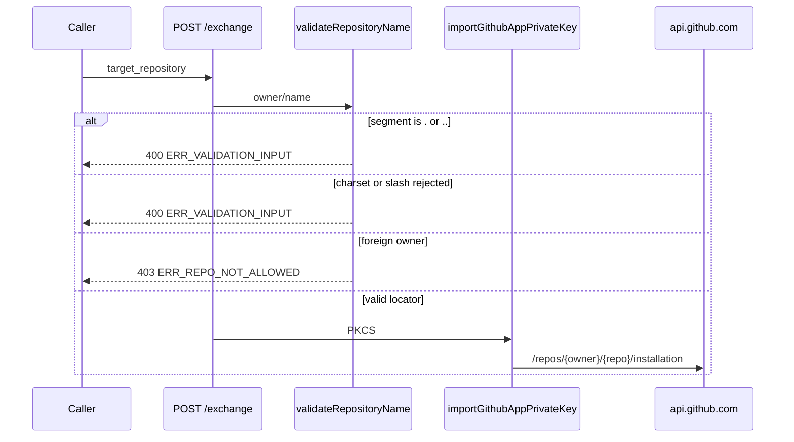

# Repository path-segment validation

## Decision

`/exchange` accepts an optional `target_repository` string in `owner/name` form. The Worker validates that locator first. Only a surviving `owner/name` may cause a GitHub App private key import. After the key is imported, Noema interpolates the same string into GitHub REST paths such as `/repos/${repository}/installation`. A caller who sends `ContextualWisdomLab/..` or `../noema` would otherwise produce a URL whose `.` / `..` segments are removed during generic URI resolution and no longer name the intended repository.

The Worker therefore rejects a repository string when either path segment is exactly `.` or `..`, and it does so as `400 ERR_VALIDATION_INPUT` before GitHub App credential work. Names that merely contain a dot, including the real `.github` repository, remain valid. A syntactically valid owner that is not the configured organization still returns `403 ERR_REPO_NOT_ALLOWED`.

Callers must send `ContextualWisdomLab/<repository>` only. Do not send path-traversal segments, percent-encoded dots, or extra slashes.

## Why this is fail-closed at the public contract

RFC 3986 defines `.` and `..` as dot segments that a resolver removes while normalizing a path. GitHub's REST path `/repos/{owner}/{repo}/installation` is a URI path, not an opaque token. If Noema forwarded `ContextualWisdomLab/..`, a later URL parser or reverse proxy could resolve it to `/repos/installation` and perform privileged work against the wrong resource.

The published OpenAPI schema and `docs/api-spec.md` must describe the same rule. A schema that accepts `owner/..` tells an integrator the request is valid while the Worker rejects it, which is a buyer-facing contract gap. The schema therefore uses RE2-safe `allOf` / `not` patterns instead of lookaheads so buyer tooling that compiles OpenAPI `pattern` with RE2 still rejects traversal segments.

The outbound fetch policy already refuses a repository name that is only `.` or `..` on the installation-token body. Request validation repeats that rule on both owner and name so the private key is never imported for a traversal string, including when tests or a future caller invoke the base Worker without the production fetch wrapper.

## Verification contract

Tests must prove:

- `ContextualWisdomLab/..` and `ContextualWisdomLab/.` return `400 ERR_VALIDATION_INPUT` with zero `api.github.com` egress;
- `../noema` and `./noema` return the same `400` rather than a later owner-allowlist `403`;
- `ContextualWisdomLab/.github` remains a legal name and reaches GitHub App private-key import;
- a foreign owner such as `OtherWisdomLab/noema` still returns `403 ERR_REPO_NOT_ALLOWED`;
- percent-encoded dots, extra slashes, backslashes, and Unicode lookalike dots return `400` with zero PKCS#8 import and zero `api.github.com` egress;
- the published OpenAPI `RepositoryLocator` schema is executed (not only string-compared), contains no lookaheads, rejects `.` / `..` segments, and accepts `.github`; and
- owned production coverage of `validateRepositoryName` and `parseExchangeRequestBody` stays at 100 percent.

## References

Berners-Lee, T., Fielding, R., & Masinter, L. (2005). *Uniform resource identifier (URI): Generic syntax* (RFC 3986). Internet Engineering Task Force. https://doi.org/10.17487/RFC3986

Cox, R. (2010). *Regular expression matching in the wild*. https://swtch.com/~rsc/regexp/regexp3.html

GitHub. (2026). *Creating and managing repositories*. GitHub Docs. https://docs.github.com/en/repositories/creating-and-managing-repositories

GitHub. (2026). *REST API endpoints for GitHub Apps*. GitHub Docs. https://docs.github.com/en/rest/apps/installations

Google. (2024). *RE2 syntax*. https://github.com/google/re2/wiki/Syntax

OpenAPI Initiative. (2021). *OpenAPI specification version 3.1.0*. The Linux Foundation. https://spec.openapis.org/oas/v3.1.0

OWASP Foundation. (2021). *A01:2021 – Broken access control*. OWASP Top 10. https://owasp.org/Top10/A01_2021-Broken_Access_Control/

Souppaya, M., Scarfone, K., & Dodson, D. (2022). *Secure software development framework (SSDF) version 1.1: Recommendations for mitigating the risk of software vulnerabilities* (NIST SP 800-218). National Institute of Standards and Technology. https://doi.org/10.6028/NIST.SP.800-218

Wright, A., Andrews, H., Hutton, B., & Dennis, G. (2022). *JSON Schema: A media type for describing JSON documents* (2020-12). https://json-schema.org/draft/2020-12/json-schema-core.html
