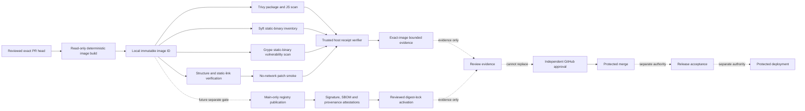

# Patch-validator image

Noema's patch-validator image executes one fixed, credential-free validation profile against a source snapshot and patch that have already crossed the authenticated host boundary described in [`quarantined-patch-validation.md`](quarantined-patch-validation.md).

Image execution and its trusted-host receipts are **validation evidence only**. They cannot approve a pull request, replace independent review, satisfy branch protection, authorize merge, publish a release, or authorize deployment.

## Current delivery scope

The current slice verifies a locally built Linux/amd64 image from the exact pull-request head. It:

- checks out and re-checks the live exact PR head with read-only GitHub authority;
- builds with an immutable Dockerfile frontend and a digest-pinned Node builder;
- compiles Node.js 24.19.0 from the official source tarball after SHA-256 verification;
- links the Node runtime fully statically and copies it into a `scratch` final image;
- excludes a shell, package manager, native addon, shared library, dynamic interpreter, and dynamic `NEEDED` dependency from the final runtime;
- runs as numeric user/group `65532:65532` with a fixed exec-form entrypoint;
- executes a real no-network, read-only, capability-dropped, non-root smoke validation;
- keeps the image's private result inside container tmpfs and treats container output as untrusted;
- synthesizes the exact-bound smoke receipt on the trusted host only after a zero container exit;
- generates a CycloneDX SBOM and Trivy vulnerability receipt for package and JavaScript dependency coverage;
- independently inventories the self-compiled Node executable with checksum-pinned Syft 1.50.0;
- independently scans the same exact local image with checksum-pinned Grype 0.116.1;
- fails closed unless Syft identifies exactly one Node 24.19.0 binary at `/nodejs/bin/node` with the expected Node.js CPE;
- fails on MEDIUM, HIGH, CRITICAL, or unknown-severity static-runtime findings and forbids ignored Grype matches;
- cross-binds image metadata, smoke, SBOM, Trivy, Syft, and Grype evidence to the same local SHA-256 image identity; and
- refuses a stale pull-request head after verification as well as before it.

The additional Syft/Grype evidence is required because Trivy documents that its OS-package vulnerability scanner does not support third-party or self-compiled packages/binaries. A clean Trivy result alone is therefore insufficient evidence for the self-compiled Node runtime.

This slice does **not** publish the image to GHCR, sign a repository-owned registry digest, create SLSA provenance, attach registry attestations, activate a digest in the reviewer decision flow, or grant release or deployment authority.

## Architecture and authority separation



The following authorities remain separate: source authentication, image build, untrusted validation execution, trusted receipt synthesis, vulnerability evidence, model judgement, GitHub review publication, independent approval, protected merge, registry publication/provenance, release acceptance, and production deployment. A success in one plane is not evidence that another plane passed.

## Image identity and runtime contents

`Dockerfile.patch-validator` pins its frontend and builder by SHA-256 digest. The builder downloads the official Node.js 24.19.0 source tarball and verifies its fixed SHA-256 before compiling with the fully-static configuration. The final stage is `scratch`; it does not inherit a distribution runtime or package database.

The PR workflow records Docker's local content identity as `sha256:<64 lowercase hexadecimal characters>`. That identity is adequate for exact-run PR verification, but it is **not** a published registry digest and is not a substitute for a signed registry subject or provenance attestation.

The final runtime contains only the fully static Node executable, lockfile-resolved image-owned TypeScript/Vitest/coverage modules, and the validator runtime files under `/opt/noema`. Static and runtime checks reject dynamic libraries, native addons, shells, and package managers.

The image carries OCI source, revision, license, title, description, and documentation labels. The trusted verifier requires the repository source and revision to match the reviewed exact head.

## Fixed validation profile

| Field | Value |
|---|---|
| profile | `node_patch_verify` |
| command profile | `node_patch_verify_v1` |
| arbitrary caller command | forbidden |

The profile accepts ordinary UTF-8 text creation, modification, and deletion for regular `100644` and `100755` files. It rejects dependency and lockfile changes, Node/Vitest configuration, reviewer and validator controls, Dockerfiles, GitHub workflows, rename/copy operations, standalone mode changes, symlink and gitlink modes, binary payloads, noncanonical paths, malformed patch metadata, and request/image identity mismatches.

The host implementation and image runtime exercise the same realistic create/delete and forbidden-mode corpus so an operation advertised by one boundary cannot silently become broader or unreachable in the other.

## Container isolation

The real smoke uses `--pull=never`, `--network=none`, `--read-only`, all capabilities dropped, `no-new-privileges`, Docker's built-in seccomp profile, isolated IPC, bounded PIDs/CPU/memory/swap/descriptors/processes/core/file size/tmpfs, numeric non-root execution, read-only source and patch mounts, private writable tmpfs, no host-writable result mount, and no Docker socket.

The untrusted container receives no GitHub App token, `GITHUB_TOKEN`, reviewer/model credential, `NVIDIA_NIM_API_KEY`, Cloudflare credential, OIDC publication token, package credential, release credential, or deployment credential.

Container stdout, stderr, and private result contents are not trusted as identity evidence. After a zero exit, trusted host code constructs the retained smoke receipt from exact workflow inputs and image identity. Any non-zero exit fails the smoke step.

## Static-runtime vulnerability boundary

Trivy remains useful for ordinary package and JavaScript dependency detection, but the final `scratch` image deliberately has no distribution package database for its self-compiled Node executable. Trivy's documented limitation means that a second, independent binary-aware path is mandatory.

The workflow therefore downloads Syft 1.50.0 and Grype 0.116.1 from their immutable releases. The SHA-256 of each release checksum manifest is pinned in workflow source; the manifest then authenticates the Linux/amd64 archive before extraction. No mutable installer script or write-capable action is used.

Syft produces native JSON from `docker:<exact local image tag>`. The trusted verifier requires:

- descriptor `syft` version `1.50.0`;
- image source type and exact local image ID;
- exactly one package named `node` at version `24.19.0`;
- a `/nodejs/bin/node` package location; and
- a Node.js 24.19.0 CPE beginning `cpe:2.3:a:nodejs:node.js:24.19.0:`.

Grype independently scans the same local Docker image with an empty configuration file (`--config /dev/null`) so repository-local ignore policy cannot silently alter the result. The trusted verifier requires descriptor `grype` version `0.116.1`, exact image ID equality, a structured match list, no ignored matches, known severity vocabulary, and zero MEDIUM/HIGH/CRITICAL/UNKNOWN findings. The CLI also uses `--fail-on medium`, so a blocking known finding fails before positive verification evidence can be emitted.

## Exact-head refusal

For pull-request events the workflow captures `github.event.pull_request.head.sha` and the PR number, checks out that exact SHA without persisted credentials, verifies a clean worktree, asks the GitHub API for the current live head, and requires equality. It repeats live-head, checkout, and worktree equality after all verification.

A concurrent push therefore invalidates the older run. Concurrency cancellation is only an optimization; explicit live-head equality is the security control.

## Evidence files

The workflow retains bounded evidence under `patch-validator-image-verification-<source SHA>` for 90 days. Expected files include:

| Evidence | Meaning |
|---|---|
| `image-inspect.json` | raw local image inspection used to derive bounded metadata |
| `image-metadata.json` | selected exact source, local digest, platform, user, entrypoint, and OCI labels |
| `smoke-result.json` | trusted-host receipt synthesized after a zero container exit |
| `image-sbom.cdx.json` | Trivy CycloneDX inventory |
| `image-vulnerability-scan.json` | Trivy package/dependency vulnerability receipt |
| `image-binary-sbom.syft.json` | Syft native inventory proving the self-compiled Node executable was classified |
| `image-binary-vulnerability-scan.json` | Grype vulnerability receipt for the exact local image |
| `image-verification.json` | merged exact-image cross-receipt verification result |

Artifact retention does not make evidence authoritative by itself. Consumers must bind the artifact to the repository, workflow run, exact source SHA, exact workflow source, and terminal successful check run.

## Operations

Expected successful checks for this stacked slice are root `ci`, `reviewer-ci`, and `verify-patch-validator-image`. Queued, pending, skipped, cancelled, neutral, stale-head, or failed runs are not success.

Failure handling is: identify the exact head and exact workflow run; separate build, static-link, smoke, Trivy, Syft, Grype, receipt, and stale-head failures; reproduce the smallest failing contract test; preserve a RED regression before production changes; change only the failing boundary; rerun all exact-head checks; and resolve a review thread only after its addressed exact head passes the relevant gates.

Do not introduce repair workflows, self-modifying workflows, or workflows with `contents: write` that patch their own branch.

## Future publication and activation gates

Issue #66 remains the separate main-only publication boundary. A later stage must provide an exact GHCR registry digest, final-image vulnerability evidence, an SBOM bound to the registry subject, verified signature identity, SLSA provenance bound to repository/commit/workflow/builder/parameters, bounded publication receipts, and a separately reviewed digest-lock activation change.

The reviewer must continue to treat validator execution and trusted receipts as evidence, never as model judgement, GitHub approval, merge authority, release authority, or deployment authority.

## Verification commands

```bash
npm run release:verify

cd reviewer
python -m pytest
python -m interrogate -c pyproject.toml noema_reviewer
```

The real container boundary is additionally exercised by `.github/workflows/patch-validator-image.yml` on every exact pull-request head.

For standards rationale and APA 7th references, see [`doctoring/patch-validator-image.md`](doctoring/patch-validator-image.md).
