# Patch-validator image

Noema's patch-validator image executes one fixed, credential-free validation profile against a source snapshot and patch that have already passed the authenticated host boundary described in [`quarantined-patch-validation.md`](quarantined-patch-validation.md).

The image execution status and trusted-host receipt are **validation evidence only**. They cannot approve a pull request, replace independent review, satisfy branch protection, authorize merge, publish a release, or authorize deployment.

## Current delivery scope

The current slice provides pull-request verification for a locally built Linux/amd64 image. It:

- builds from the exact pull-request head;
- binds the OCI revision label to that head;
- uses an immutable Dockerfile frontend and digest-pinned builder and runtime images;
- verifies the Distroless runtime signature before building;
- inspects the final image identity, architecture, numeric user, entrypoint, and OCI labels;
- proves the final image contains no shell or package manager from the denied-path inventory;
- executes a real no-network, read-only, non-root smoke validation;
- keeps the image's private result inside container tmpfs and ignores untrusted container output as evidence;
- synthesizes the exact-bound smoke receipt on the trusted host only after a zero container exit;
- generates a CycloneDX SBOM;
- fails on detected unfixed MEDIUM, HIGH, or CRITICAL final-image vulnerabilities;
- verifies bounded image metadata, trusted-host smoke, and SBOM receipts; and
- refuses a stale pull-request head both before and after verification.

This slice does **not** publish the image to GHCR, sign a repository-owned image digest, create SLSA provenance, attach registry attestations, activate a digest in the reviewer decision flow, or grant release or deployment authority.

## Architecture and authority separation

```mermaid
flowchart LR
    A[Reviewed exact PR head] --> B[Read-only image build]
    B --> C[Local immutable image ID]
    C --> D[Structure and vulnerability verification]
    D --> E[No-network patch smoke]
    E --> F[Trusted host synthesizes bound smoke receipt]
    F --> G[Bounded verification receipts]

    G -. evidence only .-> H[Review evidence]
    H -. cannot replace .-> I[Independent GitHub approval]
    I --> J[Protected merge]

    C -. future separate gate .-> K[Main-only registry publication]
    K --> L[Signature, SBOM and provenance attestations]
    L --> M[Reviewed digest-lock activation]
    M -. evidence only .-> H

    J -. separate authority .-> N[Release acceptance]
    N -. separate authority .-> O[Protected deployment]
```



The following authorities remain separate:

1. source and patch authentication;
2. image build and local verification;
3. untrusted patch execution;
4. trusted-host receipt synthesis;
5. model judgement;
6. GitHub review publication;
7. independent approval;
8. protected merge;
9. image publication and provenance;
10. release acceptance; and
11. production deployment.

A success in one stage is not evidence that another stage passed.

## Image identity

`Dockerfile.patch-validator` pins:

- its Dockerfile frontend by SHA-256 digest;
- the Node.js builder image by SHA-256 digest; and
- the Distroless Node.js runtime by SHA-256 digest.

The PR workflow records Docker's local content identity in the form:

```text
sha256:<64 lowercase hexadecimal characters>
```

That local image ID is adequate for exact-run PR verification, but it is **not** a published registry digest and is not a substitute for a signed registry subject or provenance attestation.

The image carries these OCI labels:

- `org.opencontainers.image.source`;
- `org.opencontainers.image.revision`;
- `org.opencontainers.image.licenses`;
- `org.opencontainers.image.title`;
- `org.opencontainers.image.description`; and
- `org.opencontainers.image.documentation`.

The metadata verifier requires the source and revision labels to match the reviewed repository and exact source head.

## Runtime contents

The final runtime is Distroless and runs as numeric user and group `65532:65532`. It contains:

- the Node.js runtime supplied by the pinned Distroless base;
- lockfile-resolved TypeScript, Vitest, and coverage modules;
- `/opt/noema/validate-patch.mjs`; and
- `/opt/noema/runtime.mjs`.

The runtime wrapper injects Vitest's read-only runner configuration loader so configuration can be evaluated without writing generated bundles into the authenticated input mount. It creates its private result file exclusively with mode `0600` inside the writable workspace tmpfs. That private file is not mounted back to the host and is not accepted as host evidence.

The final stage does not execute a package installation command. Static and runtime checks reject an image containing the denied shell or package-manager paths.

## Fixed validation profile

The first image-owned profile is:

| Field | Value |
|---|---|
| profile | `node_patch_verify` |
| command profile | `node_patch_verify_v1` |
| arbitrary caller command | forbidden |

The profile accepts ordinary UTF-8 text creation, modification, and deletion for regular `100644` and `100755` files. Canonical Git `new file mode` and `deleted file mode` metadata remain reachable for those operations.

It rejects:

- dependency, lockfile, Node configuration, Vitest configuration, reviewer, validator, Dockerfile, and GitHub workflow paths;
- rename and copy operations;
- standalone executable-mode changes;
- symlink and gitlink modes;
- binary payloads;
- noncanonical or unsafe paths;
- malformed headers, metadata, hunks, or newline markers;
- source mismatch and hunk-count mismatch; and
- any request, image digest, or trusted-host result identity mismatch.

The host implementation and image runtime test the same create/delete and forbidden-mode corpus to prevent an operation advertised by one boundary from becoming unreachable or broader in the other.

## Container isolation

The real smoke and host runner use the following Docker controls:

- `--pull=never`;
- `--network=none`;
- `--read-only`;
- all Linux capabilities dropped;
- `no-new-privileges`;
- the built-in seccomp profile;
- isolated IPC;
- bounded PIDs, CPU, memory, swap, descriptors, processes, core size, file size, tmpfs, and wall time;
- a numeric non-root host UID/GID;
- read-only source and patch mounts;
- a private writable workspace tmpfs for transient execution and the image-internal result;
- no host-writable result mount; and
- no Docker socket.

The untrusted container receives no GitHub App token, `GITHUB_TOKEN`, reviewer/model credential, `NVIDIA_NIM_API_KEY`, Cloudflare credential, OIDC publication token, package credential, release credential, or deployment credential.

Container stdout, stderr, and private result contents are not trusted as identity evidence. After a zero exit, the trusted host constructs the retained smoke receipt from the exact workflow inputs and image identity. Any non-zero exit fails the smoke step.

## Exact-head refusal

For pull-request events, the workflow captures `github.event.pull_request.head.sha` and the pull-request number. It then:

1. checks out that exact SHA without persisted credentials;
2. verifies the checked-out SHA and clean worktree;
3. reads the live PR head through a read-only GitHub API call and requires equality before the build;
4. builds, scans, smokes, synthesizes trusted evidence, and verifies receipts; and
5. repeats the live-head, checkout, and clean-worktree checks before evidence upload.

A concurrent push makes the old workflow run fail instead of allowing stale evidence to be interpreted as current-head evidence. Concurrency cancellation is an optimization, not the security control; explicit live-head equality is the control.

## Evidence files

The workflow retains bounded evidence under the `patch-validator-image-verification-<source SHA>` artifact name for 90 days. Expected files include:

| Evidence | Meaning |
|---|---|
| `distroless-signature-verification.json` | verification output for the pinned upstream runtime base |
| `image-inspect.json` | raw local image inspection used to derive bounded metadata |
| `image-metadata.json` | selected source, digest, platform, user, entrypoint, and OCI labels |
| `smoke-result.json` | trusted-host receipt synthesized after a zero container exit and bound to the exact request, profile, and image identity |
| `image-sbom.cdx.json` | CycloneDX component inventory generated from the final image |
| `image-vulnerability-scan.json` | final-image Trivy vulnerability receipt |
| `image-verification.json` | bounded cross-receipt verification result |

Artifact retention does not make evidence authoritative by itself. Consumers must bind the artifact to the workflow run, repository, exact source SHA, expected workflow source, and terminal successful check run.

## Operations

### Pull-request verification

The workflow runs on every pull-request head, so an image check cannot disappear merely because a later commit changes only an indirectly relevant file. A manual dispatch verifies the selected trusted ref but has no pull-request number to compare.

Expected successful checks for this stacked slice are:

- root `ci`;
- `reviewer-ci`; and
- `verify-patch-validator-image` from `patch-validator-image`.

A queued, pending, skipped, cancelled, neutral, stale-head, or failed run is not success.

### Failure handling

1. Identify the exact head and workflow run before reading logs.
2. Separate build, structure, smoke, vulnerability, SBOM, receipt, and live-head failures.
3. Reproduce the smallest failing contract test first.
4. Add or preserve a RED regression before production changes.
5. Change only the failing boundary.
6. Rerun the complete exact-head checks.
7. Resolve a review thread only after the addressed exact head passes its relevant gates.

Do not add a repair workflow, a self-modifying workflow, or a workflow with `contents: write` that patches its own branch.

### Rollback

Because this slice does not publish or activate a registry digest, rollback means reverting the reviewed image/workflow commits and rerunning exact-head verification. No production image pointer changes in this slice.

A future activation rollback must be a separate reviewed change that restores the last independently verified digest. It must not select a mutable tag.

### Incident response

Treat these events as security incidents requiring evidence preservation and credential review:

- a digest, source revision, or entrypoint mismatch;
- a stale-head check that unexpectedly passes;
- unexpected network access or writable host mounts;
- discovery of a shell, package manager, Git client, or credential in the runtime;
- private result-path escape, trusted-receipt identity mismatch, or acceptance of container-controlled evidence;
- a vulnerability gate bypass;
- an unknown workflow producer using a trusted check name; or
- provenance or signature verification against an unexpected issuer or workflow identity in a future publication stage.

The current PR workflow contains no publication credential, so compromise of untrusted validation must not be able to publish packages, approve a PR, merge code, release, or deploy.

## Future publication and activation gates

Issue #66 remains open after this slice. A later main-only publication stage must independently provide:

- a GHCR registry digest built from an accepted exact commit;
- a final-image vulnerability receipt;
- a CycloneDX or SPDX SBOM bound to the registry subject;
- a verified signature with exact issuer and workflow identity;
- SLSA provenance bound to repository, commit, workflow source, builder, and parameters;
- bounded publication and verification receipts; and
- a separate digest-lock activation PR.

The reviewer must still treat image execution and trusted-host receipts as evidence. It must not convert validator evidence into model judgement, GitHub approval, merge authority, release authority, or deployment authority.

## Verification commands

```bash
npm run release:verify

cd reviewer
python -m pytest
python -m interrogate -c pyproject.toml noema_reviewer
```

The real image boundary is additionally exercised by `.github/workflows/patch-validator-image.yml` on every exact pull-request head.

For standards rationale and APA 7th references, see [`doctoring/patch-validator-image.md`](doctoring/patch-validator-image.md).
