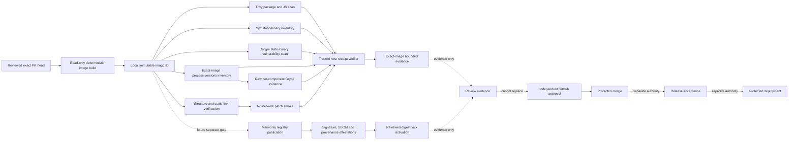

# Patch-validator image

Noema's patch-validator image executes one fixed, credential-free validation profile against a source snapshot and patch that have already crossed the authenticated host boundary described in [`quarantined-patch-validation.md`](quarantined-patch-validation.md).

Image execution and trusted-host receipts are **validation evidence only**. They cannot approve a pull request, replace independent review, satisfy branch protection, authorize merge, publish a release, or authorize deployment.

## Current delivery scope

The current slice verifies a locally built Linux/amd64 image from the exact pull-request head. It:

- checks and re-checks the live exact PR head with read-only GitHub authority;
- builds with an immutable Dockerfile frontend and digest-pinned builders;
- compiles Node.js 24.19.0 from the official source tarball after fixed SHA-256 authentication;
- links Node fully statically and copies it into a `scratch` final image;
- excludes a shell, package manager, native addon, shared library, dynamic interpreter, and dynamic `NEEDED` dependency from the final runtime;
- runs as numeric user/group `65532:65532` with a fixed exec-form entrypoint;
- executes a real no-network, read-only, capability-dropped, non-root smoke validation;
- keeps the image's private result inside container tmpfs and treats container output as untrusted;
- synthesizes the exact-bound smoke receipt on the trusted host only after a zero container exit;
- generates a Trivy CycloneDX image SBOM and image vulnerability receipt;
- inventories the self-compiled Node executable with checksum-pinned Syft 1.50.0;
- scans the same exact local image with checksum-pinned Grype 0.116.1;
- captures the exact image's Node `process.versions` record and requires an exact reviewed embedded-component set;
- treats only `modules` and `napi` as reviewed ABI/runtime metadata instead of fabricating package identities for those counters;
- requires every other reviewed component to have an exact supported npm PURL or reviewed application CPE;
- retains raw per-component Grype JSON for every reviewed embedded dependency rather than inventing a local completion object;
- requires one canonical vulnerability-database/provider snapshot across those per-component scans;
- binds every vulnerability match artifact back to the exact reviewed component identity;
- fails closed on unsupported, partial, wildcard, substituted, omitted, ambiguous, or unmapped component identities;
- rejects ignored findings and blocks MEDIUM, HIGH, CRITICAL, or UNKNOWN severity findings;
- applies an explicit reviewed fixed-version floor when scanner-negative evidence is known to be insufficient for a component;
- cross-binds image metadata, smoke, SBOM, Trivy, Syft, Grype, embedded-runtime inventory, and embedded-runtime scan evidence to the same local SHA-256 image identity; and
- refuses a stale pull-request head after verification as well as before it.

The additional Syft/Grype evidence is required because a package-oriented scanner cannot by itself prove complete vulnerability assessment of a self-compiled, fully static Node executable. Likewise, a clean Node-level CPE result is not accepted as complete evidence for bundled native dependencies. If a reviewed `process.versions` entry cannot be represented or matched reliably, the verifier fails closed instead of omitting it or treating scanner silence as proof of absence.

This slice does **not** publish the image to GHCR, sign a repository-owned registry digest, create SLSA provenance, attach registry attestations, activate a digest in the reviewer decision flow, or grant release or deployment authority.

## Architecture and authority separation

The following authorities remain separate: source authentication, image build, untrusted validation execution, trusted receipt synthesis, vulnerability evidence, model judgement, GitHub review publication, independent approval, protected merge, registry publication/provenance, release acceptance, and production deployment. Success in one plane is not evidence that another plane passed.

## Image identity and runtime contents

`Dockerfile.patch-validator` pins its Dockerfile frontend and non-final builders by SHA-256 digest. The Node builder downloads the official Node.js 24.19.0 source tarball with a fixed SHA-256 and compiles it with the fully-static configuration. The final stage is `scratch`; it does not inherit a distribution runtime or package database.

The static Node package note carries the reviewed Node.js application CPE and metadata. It deliberately does not claim a `pkg:generic` identity. Generic package URLs are not accepted as evidence that the configured vulnerability matcher can identify a component.

The PR workflow records Docker's local content identity as `sha256:<64 lowercase hexadecimal characters>`. That identity is adequate for exact-run PR verification, but it is **not** a published registry digest and is not a substitute for a signed registry subject or provenance attestation.

The final runtime contains the fully static Node executable, lockfile-resolved image-owned TypeScript/Vitest/coverage modules, and validator runtime files under `/opt/noema`. Static and runtime checks reject dynamic libraries, native addons, shells, and package managers.

The image carries OCI source, revision, title, description, and documentation labels. It intentionally emits **no `org.opencontainers.image.licenses` label while Noema has no approved outbound-rights declaration and `package.json` has no license field**. Repository visibility, `private: true`, or an invented `LicenseRef-*` value is not legal authority. An owner/legal licensing decision must be captured through the repository-wide licensing/IP evidence contract before an OCI license claim is added. The trusted verifier still requires the repository source and revision to match the reviewed exact head.

## Fixed validation profile

| Field | Value |
|---|---|
| profile | `node_patch_verify` |
| command profile | `node_patch_verify_v1` |
| arbitrary caller command | forbidden |

The profile accepts ordinary UTF-8 text creation, modification, and deletion for regular `100644` and `100755` files. It rejects dependency and lockfile changes, Node/Vitest configuration, reviewer and validator controls, Dockerfiles, GitHub workflows, rename/copy operations, standalone mode changes, symlink and gitlink modes, binary payloads, noncanonical paths, malformed patch metadata, and request/image identity mismatches.

The host implementation and image runtime exercise the same realistic create/delete and forbidden-mode corpus so an operation advertised by one boundary cannot silently become broader or unreachable in the other.

## Container isolation

The real smoke uses `--pull=never`, `--network=none`, `--read-only`, all capabilities dropped, `no-new-privileges`, Docker's built-in seccomp profile, isolated IPC, bounded PIDs/CPU/memory/swap/descriptors/processes/core/file size/tmpfs, numeric non-root execution, read-only source and patch mounts, private writable tmpfs, no host-writable result mount, and no Docker socket.

The untrusted container receives no GitHub App token, `GITHUB_TOKEN`, reviewer/model credential, `NVIDIA_NIM_API_KEY`, Cloudflare credential, OIDC publication token, package credential, release credential, or deployment credential.

Container stdout, stderr, and private result contents are not trusted as identity evidence. After a zero exit, trusted host code constructs the retained smoke receipt from exact workflow inputs and image identity. Any non-zero exit fails the smoke step.

## Static-runtime vulnerability boundary

Trivy covers the ordinary image/package and JavaScript dependency surface. Syft separately proves that the self-compiled executable is catalogued as Node 24.19.0 at `/nodejs/bin/node` with the reviewed Node.js CPE. Grype separately scans that exact local image. The trusted verifier binds scanner descriptors, source targets, image identity, match structure, ignored-match policy, and severity policy.

A zero match count is not independently interpreted as proof that every static dependency was evaluated. The embedded-runtime boundary below exists specifically to avoid that inference.

## Embedded-runtime component evidence

The workflow runs the exact built Node executable and records `process.versions`. The trusted verifier requires `node` to equal `24.19.0`. It accepts `modules` and `napi` only as reviewed runtime metadata with explicit reasons; every other key must be represented by the reviewed component-identity catalog.

For each reviewed embedded dependency, the catalog binds the exact `process.versions` key, inventory name, version, and either a supported npm PURL package identity or a reviewed application CPE vendor/product identity. Wildcards, placeholders, partial identities, arbitrary aliases, version substitution, package substitution, and unknown components fail closed.

The workflow invokes Grype directly for each exact reviewed identity and retains the **raw per-component Grype** JSON. The verifier does not synthesize a local assessment object merely because Grype exited zero. For every component it verifies:

- scanner name and exact version;
- exact scanner source type and target identity;
- canonical vulnerability-database status and provider metadata;
- one identical canonical database/provider snapshot across all component scans;
- raw match structure;
- exact reviewed PURL or CPE binding on each match artifact;
- reviewed name/version agreement where those fields are present;
- no ignored-match or VEX shortcut; and
- the blocking severity policy.

When an exact supported scanner identity cannot be established for a component, that component remains an explicit release blocker. Scanner silence is not converted into a supported/clean claim. A reviewed component-specific fixed-version floor can add a stricter fail-closed condition; it cannot downgrade severity or ignore a scanner finding.

## Exact-head refusal

For pull-request events the workflow captures `github.event.pull_request.head.sha` and the PR number, checks out that exact SHA without persisted credentials, verifies a clean worktree, asks the GitHub API for the current live head, and requires equality. It repeats live-head, checkout, and worktree equality after verification.

A concurrent push therefore invalidates the older run. Concurrency cancellation is only an optimization; explicit live-head equality is the security control.

## Evidence files

The workflow retains bounded evidence under `patch-validator-image-verification-<source SHA>` for 90 days. Expected files include:

| Evidence | Meaning |
|---|---|
| `image-inspect.json` | raw local image inspection used to derive bounded metadata |
| `image-metadata.json` | selected exact source, local digest, platform, user, entrypoint, and OCI labels |
| `smoke-result.json` | trusted-host receipt synthesized after a zero container exit |
| `image-sbom.cdx.json` | Trivy CycloneDX image inventory |
| `image-vulnerability-scan.json` | Trivy image/package vulnerability receipt |
| `image-binary-sbom.syft.json` | Syft native inventory proving the self-compiled Node executable was classified |
| `image-binary-vulnerability-scan.json` | Grype vulnerability receipt for the exact local image |
| `embedded-runtime-process-versions.json` | bounded exact-image `process.versions` source record |
| `embedded-runtime-inventory.json` | reviewed exact component set derived from `process.versions` |
| `embedded-runtime-vulnerability-scan.json` | exact-image-bound retained raw per-component Grype evidence and trusted verification summary |
| `image-verification.json` | merged exact-image cross-receipt verification result |

Artifact retention does not make evidence authoritative by itself. Consumers must bind the artifact to the repository, workflow run, exact source SHA, exact workflow source, and terminal successful check run.

## Operations

Expected successful checks for this stacked slice are root `ci`, `reviewer-ci`, and `patch-validator-image`. Queued, pending, skipped, cancelled, neutral, stale-head, or failed runs are not success.

Failure handling is: identify the exact head and exact workflow run; separate build, static-link, smoke, Trivy, Syft, Grype, embedded-runtime inventory/scan, receipt, and stale-head failures; reproduce the smallest failing contract test; preserve a RED regression before production changes; change only the failing boundary; rerun all exact-head checks; and resolve review feedback only after its addressed exact head passes the relevant gates.

## Scientific and standards rationale

The implementation rationale and APA 7th references are maintained in the doctoring documents associated with this image and its embedded-runtime assessment. Public operations text intentionally describes only controls that current repository code and retained evidence can prove. Publication, signature, provenance, independent approval, protected merge, release acceptance, and deployment remain separate gates.